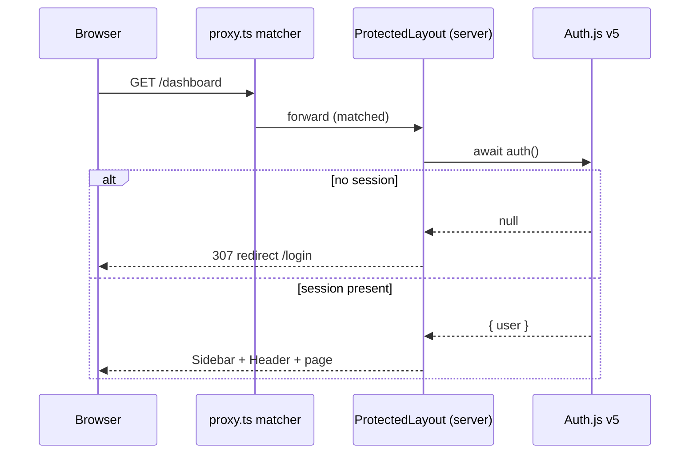
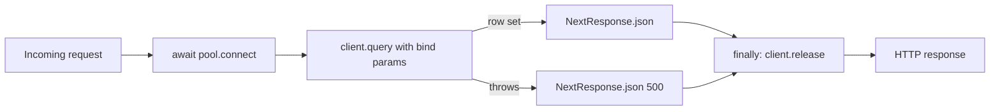
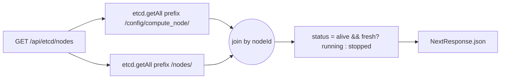
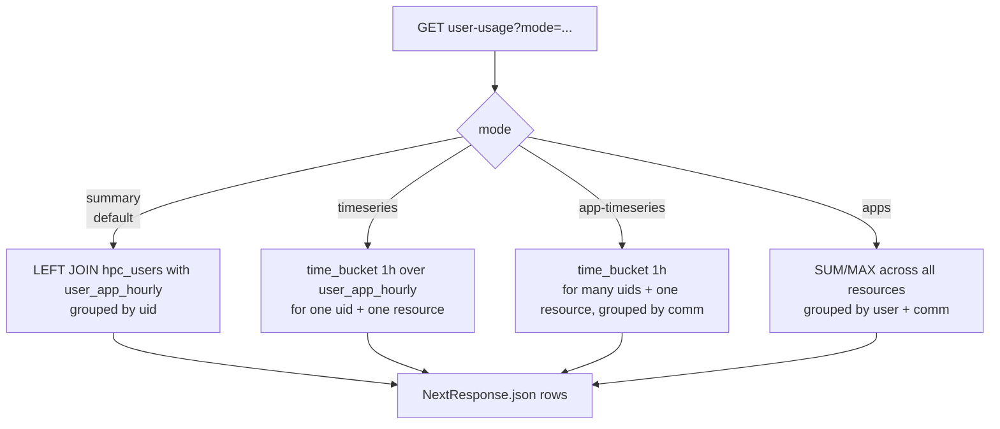
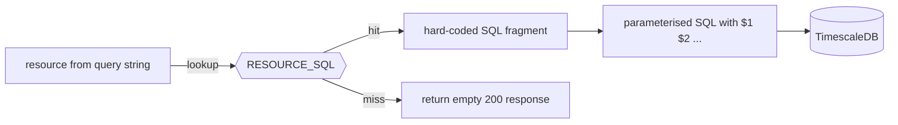
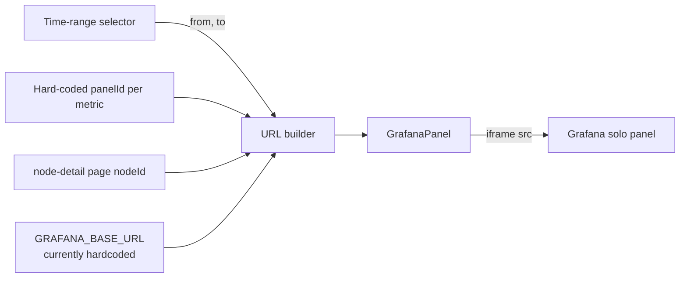
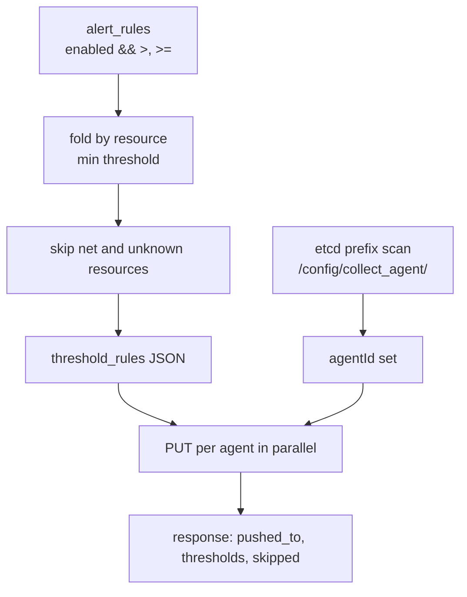
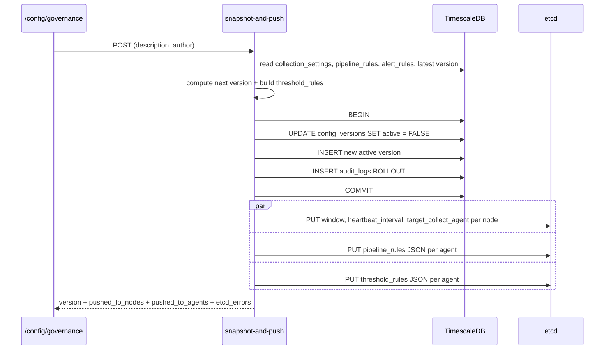
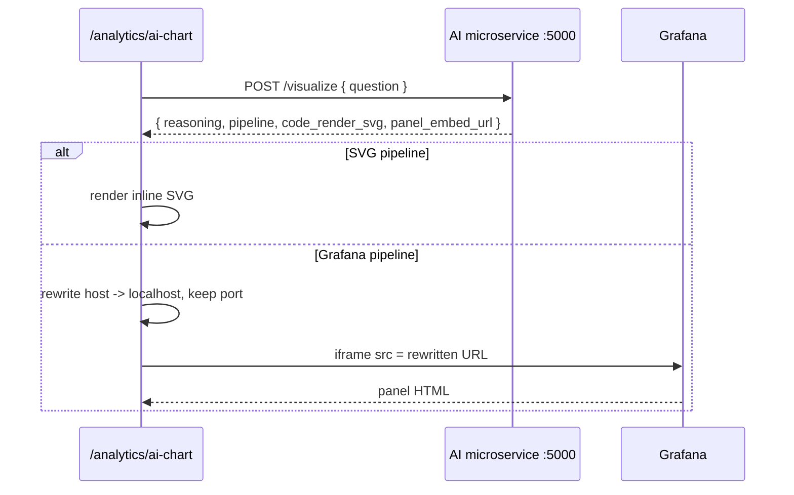

# Chapter 4 — Implementation

> **Estimated length:** 15–20 pages.
> **Purpose:** describe *how* each module was built — the method, the data flow, the decisions, and the pitfalls — without pasting source code. Diagrams replace code where a picture is clearer. File paths are cited so the reader can open the implementation directly.

## 4.0 How to read this chapter

Each module below follows the same three-part structure.

1. **Goal** — one sentence on what the module delivers.
2. **Method and data flow** — how it is built and how a request travels through it, usually with a small diagram.
3. **Decisions and pitfalls** — the trade-offs that required thought and the mistakes a reader should avoid.

The chapter does not contain source listings. Every claim is anchored to a file path in the repository (e.g. [src/app/api/analytics/user-usage/route.ts](../src/app/api/analytics/user-usage/route.ts)); open that file to see the code.

## 4.1 Project bootstrap

### Goal

Produce a runnable Next.js 16 project with TypeScript, Tailwind v4, and the environment variables that every downstream module needs.

### Method

The project was scaffolded with the official Next.js CLI (`npx create-next-app`) selecting TypeScript and the App Router. Four runtime dependencies were added on top of the scaffold: Auth.js v5 (authentication), `pg` (PostgreSQL driver), `etcd3` (etcd client), and Recharts (analytics charts). Tailwind v4 is pulled through `tailwindcss` and `@tailwindcss/postcss` without a JS config file — the theme tokens are declared directly in CSS.

Environment variables are separated by concern, each read by exactly one module:

| Variable | Consumer file | Purpose |
|---|---|---|
| `NEXTAUTH_SECRET` | [src/auth.ts](../src/auth.ts) | JWT signing secret |
| `ADMIN_EMAIL`, `ADMIN_PASSWORD` | [src/auth.ts](../src/auth.ts) | single administrator credentials |
| `TIMESCALE_URL` | [src/lib/db.ts](../src/lib/db.ts) | libpq connection string |
| `ETCD_URL` | [src/lib/etcd.ts](../src/lib/etcd.ts) | `http://host:2379` endpoint |

### Decisions

- **No dotenv library.** Next.js 16 loads `.env.local` automatically; adding `dotenv` would duplicate that behaviour.
- **No `tailwind.config.ts`.** Tailwind v4 supports theme declaration directly inside CSS (`@theme { … }` in [src/app/globals.css](../src/app/globals.css)), which keeps the visual identity in a single file.

## 4.2 Authentication and route protection

### Goal

Guarantee that every page can be reached only after a successful login, and that the same gate can be extended to API routes later.

### Method and data flow

Authentication is handled by Auth.js v5 with the Credentials provider, JWT session strategy, and a single user whose identity lives in environment variables. Three pieces cooperate:

1. The **proxy** file [src/proxy.ts](../src/proxy.ts) re-exports Auth.js's `auth` function and declares a URL matcher that intercepts every request except `/login`, `/api/auth/*`, and static assets.
2. The **protected layout** at [src/app/(protected)/layout.tsx](../src/app/(protected)/layout.tsx) is a server component. It calls `auth()` on every request and redirects to `/login` when the session is null.
3. The **login page** at [src/app/(auth)/login/page.tsx](../src/app/(auth)/login/page.tsx) is a client component. It calls `signIn("credentials", …)` and, on success, navigates to `/dashboard`.



### Decisions and pitfalls

- Next.js 16 renamed *middleware* to *proxy*; a file called `middleware.ts` is silently ignored. The file in this project is therefore `proxy.ts` and it exports `{ auth as proxy }`.
- The proxy matcher currently excludes `/api/auth` but not the rest of `/api/*`. HTML pages are safe, JSON endpoints are not. This is acknowledged in [Chapter 6 §6.2](06-conclusion.md#62-limitations) and a fix (calling `auth()` at the top of each handler) is scheduled.
- JWT sessions avoid a server-side session store, which fits the single-process thesis deployment.

## 4.3 Data access layer

### Goal

Give every API route one shared PostgreSQL pool and one shared etcd client, with a pattern that cannot exhaust connections.

### Method

Two singletons are created at module-load time:

- [src/lib/db.ts](../src/lib/db.ts) exports a default `pg.Pool` built from `TIMESCALE_URL`.
- [src/lib/etcd.ts](../src/lib/etcd.ts) exports a default `Etcd3` client built from `ETCD_URL`.

Every API handler that touches PostgreSQL follows the same four-step shape: *acquire → query → release → translate to HTTP*.



Shared TypeScript types live in [src/types/index.ts](../src/types/index.ts) and are imported by both the server (for query-result typing) and the client (for the shape of fetched JSON).

### Decisions

- **No ORM.** The schema is small and analytics queries lean heavily on TimescaleDB-specific features (`time_bucket`, `DISTINCT ON`), which ORMs abstract awkwardly.
- **`try/catch/finally` pattern.** Release is placed in `finally` so a thrown error still returns the connection to the pool. Forgetting this on a single route would eventually starve the entire application.

## 4.4 Node registry module

### Goal

Maintain the `nodes` table and expose latest metrics per node for the node-list page.

### Method

Four API routes cooperate with two pages:

| File | Role |
|---|---|
| [src/app/api/nodes/route.ts](../src/app/api/nodes/route.ts) | list and create |
| [src/app/api/nodes/[nodeId]/route.ts](../src/app/api/nodes/[nodeId]/route.ts) | read, update, delete by id |
| [src/app/api/nodes/metrics/latest/route.ts](../src/app/api/nodes/metrics/latest/route.ts) | latest hourly bucket per node |
| [src/app/api/nodes/[nodeId]/hourly/route.ts](../src/app/api/nodes/[nodeId]/hourly/route.ts) | time-series for one node |
| [src/app/(protected)/dashboard/nodes/page.tsx](../src/app/(protected)/dashboard/nodes/page.tsx) | node list |
| [src/app/(protected)/dashboard/nodes/[nodeId]/page.tsx](../src/app/(protected)/dashboard/nodes/[nodeId]/page.tsx) | node detail |

### Data-flow sketch for the node list

The node list merges **three** independent data sources: the admin `nodes` table, the live configuration in etcd, and the latest hourly bucket from `node_status_hourly`. Each is fetched in parallel on mount.

```mermaid
flowchart LR
    page[Node list page] -->|fetch| a[/api/nodes]
    page -->|fetch| b[/api/etcd/nodes]
    page -->|fetch| c[/api/nodes/metrics/latest]
    a --> tsdb1[(nodes table)]
    b --> etcd[(etcd)]
    c --> tsdb2[(node_status_hourly)]
    a & b & c --> merge[join by nodeId]
    merge --> render[Render sortable table]
```

### Decisions and pitfalls

- The "latest bucket" query uses PostgreSQL `DISTINCT ON (node_id)` ordered by `bucket_time DESC`. This is a native, index-friendly way to get one row per node.
- A node can be present in the admin DB but absent from etcd (not provisioned yet) or vice versa. The UI keeps the union of both and marks which side is missing.

## 4.5 Live pipeline configuration (etcd module)

### Goal

Let the administrator see real-time agent configuration, add new nodes and agents to etcd, and turn collection on or off per node.

### Method

The endpoints are grouped by prefix: `/api/etcd/nodes/...` talks to `/config/compute_node/`, and `/api/etcd/agents/...` talks to `/config/collect_agent/`. Each route uses the `etcd3` client's `getAll().prefix(...).strings()` pattern to read a whole subtree as a flat key→value map, then reconstructs structured objects from the flat keys by slicing the prefix and splitting on `/`.

The most interesting handler is the node list, which performs a **fan-in**: it reads two prefixes in parallel (configs and heartbeats), joins them in memory by node id, and derives each node's liveness from heartbeat staleness before returning.



Status derivation uses the rule stated in [Chapter 3 §3.6](03-architecture-design.md#36-etcd-key-schema): a node is *running* only when its last heartbeat is recent (within `heartbeat_interval × 3` seconds) and its self-reported status is `alive`. This is implemented inside [src/app/api/etcd/nodes/route.ts](../src/app/api/etcd/nodes/route.ts).

Start/stop is a single PUT on `/config/compute_node/{nodeId}/status`, exposed at [src/app/api/etcd/nodes/[nodeId]/status/route.ts](../src/app/api/etcd/nodes/[nodeId]/status/route.ts).

### Decisions and pitfalls

- etcd values are always strings. JSON-typed fields (`kafka_brokers`, `threshold_rules`, `pipeline_stages`, `process_fields`, `comm_prefixes`) are serialised on every write and parsed on every read; the parsing is wrapped in a `try/catch` so a malformed key never crashes the whole listing.
- Agent and node identifiers are **discovered** from the etcd prefix scan, not maintained in a separate registry. This matches the operational reality that new agents come and go.

## 4.6 Analytics module

### Goal

Answer three classes of questions from TimescaleDB:

- What is the cluster doing right now (last *N* hours)?
- Who is using the cluster, and how much (per user)?
- How did a single user or application behave over time?

### Method

Two API routes cover all three questions:

| File | Role |
|---|---|
| [src/app/api/analytics/cluster-stats/route.ts](../src/app/api/analytics/cluster-stats/route.ts) | cluster-level averages for 1h / 6h / 24h |
| [src/app/api/analytics/user-usage/route.ts](../src/app/api/analytics/user-usage/route.ts) | four modes (`summary`, `timeseries`, `apps`, `app-timeseries`) over `user_app_hourly` |

The `user-usage` handler uses a *mode switch* rather than four separate routes because the inputs (uid list, resource, date range) and the output shape (`rows`) are uniform. The switch is shown below.



All four modes share the same parameter parsing (dates default to "the last seven days", uid list is parsed and validated), the same bind-parameter discipline, and the same error handling.

### The SQL-safety method

Because `resource` is a user-controlled string that selects which aggregation expression to run, naive string interpolation would be a classic SQL injection. The method used here is an **allow-list map** declared at module scope: the key is the resource name, the value is a hard-coded SQL fragment (for example `SUM(h.total_cpu_time_seconds)`). When the request arrives, the handler *looks up* the fragment and rejects the request when the key is unknown. No user input ever reaches the SQL text.



### Decisions and pitfalls

- `time_bucket` is a TimescaleDB extension function; vanilla PostgreSQL will not run this code.
- The `summary` mode performs a `LEFT JOIN` from `hpc_users` so every user shows up even when they produced no records in the date range; without this, idle users would disappear silently from the page.
- The cluster-stats endpoint accepts `range` only from a small whitelist (`1h`, `6h`, `24h`) before the value is cast to a SQL interval.

## 4.7 Real-time monitoring (Grafana embedding)

### Goal

Embed Grafana panels inside the admin UI instead of duplicating Grafana's chart engine.

### Method

A single reusable component — [src/components/dashboard/GrafanaPanel.tsx](../src/components/dashboard/GrafanaPanel.tsx) — wraps an `<iframe>`, shows a loading placeholder until the `onLoad` event fires, and falls back to an explanatory empty state when its `src` prop is empty. Pages compose the iframe URL from three variable pieces:

| Piece | Source |
|---|---|
| `panelId` | hard-coded per metric (CPU, memory, GPU, disk, network) |
| `var-node` | only on node-detail pages; URL-encoded node id |
| `from` / `to` | derived from the time-range selector |



The Grafana side is opted into solo-panel mode with a URL query flag (`__feature.dashboardSceneSolo=true`) so the dashboard chrome is not rendered.

### Decisions and pitfalls

- **Why an iframe and not a server-side render?** Grafana owns the rendering and already knows the TimescaleDB schema. Re-implementing the same panels in the admin app would create a second source of truth.
- **Cross-origin silent failures.** Iframes do not raise CORS errors when blocked; they just appear empty. If the admin's browser cannot reach Grafana (VPN, IP allow-list), the user sees a blank panel with no error. The placeholder in `GrafanaPanel` addresses the "no URL configured" case but cannot see a reachability problem.
- **Hardcoded base URL.** Several pages interpolate the Grafana host literally. Extracting this into a single URL builder is listed in [Chapter 6 §6.3](06-conclusion.md#63-future-work).

## 4.8 Configuration management module

This is the most involved module, so it is split into three sub-areas: collection settings, rules (pipeline + alerts), and governance.

### 4.8.1 Collection settings

### Goal

Let the administrator edit per-node collection intervals, windows, and the collect-agent assignment, while keeping the DB and etcd in sync.

### Method

The list endpoint performs a `LEFT JOIN` of `nodes` and `collection_settings`, so nodes without a custom setting still appear with their defaults. The PUT endpoint at [src/app/api/config/collection/[nodeId]/route.ts](../src/app/api/config/collection/[nodeId]/route.ts) performs an **UPSERT** in the DB first and then *mirrors* the three relevant fields (`window`, `heartbeat_interval`, `target_collect_agent`) to etcd.

The mirror is deliberately **non-fatal**: a failure on the etcd side does not roll back the DB write. The UI surfaces any etcd error so the administrator knows the keys are out of sync.

### 4.8.2 Pipeline and alert rules

### Goal

Maintain the DB-backed catalogue of rules, then fan the enabled subset out to every discovered collect agent.

### Method

Both rule types have the same CRUD shape in the database: list, insert, update, delete. The fan-out is triggered by a dedicated action endpoint:

- `POST /api/config/pipeline/push-to-etcd` writes all *enabled* pipeline rules as a JSON array under `/config/collect_agent/{agentId}/pipeline_rules` for every discovered agent. See [src/app/api/config/pipeline/push-to-etcd/route.ts](../src/app/api/config/pipeline/push-to-etcd/route.ts). The target schema expected by the collect agent is actually three separate keys (`pipeline_stages`, `process_fields`, `comm_prefixes`); aligning the push handler with that schema is tracked in [Chapter 6 §6.3](06-conclusion.md#63-future-work).
- `POST /api/config/alerts/push-to-etcd` folds upper-bound alert rules (operators `>` and `>=`) into a single `threshold_rules` object keyed by the etcd-side name (`cpu_usage_percent`, `memory_usage_percent`, `gpu_utilization_percent`, `disk_usage_percent`) and writes that object under `/config/collect_agent/{agentId}/threshold_rules`. See [src/app/api/config/alerts/push-to-etcd/route.ts](../src/app/api/config/alerts/push-to-etcd/route.ts).

Two mapping rules matter:

1. **Resource name mapping.** The DB values (`cpu`, `mem`, `gpu`, `disk`, `net`) are mapped to the etcd keys through a constant dictionary. `net` has no etcd counterpart and is deliberately skipped — those rules remain in-app alerts only.
2. **"Most restrictive wins".** If two alerts target the same resource, the lower threshold prevails. The UI documents this in a tooltip.



### Decisions and pitfalls

- **Semantic status codes.** The alert-push handler returns `422 Unprocessable Entity` when there are no syncable rules and `404` when there are no agents. Neither is a server error, so a `500` would mislead the UI.
- **Parallel fan-out.** Writes to different agents are independent; they are issued with `Promise.all` rather than sequentially.

### 4.8.3 Governance (snapshot-and-push, rollout, versions, audit)

### Goal

Make every configuration change reversible and accountable by versioning the full state and recording who did what.

### Method — snapshot-and-push

The flow combines a DB-first transaction with a best-effort etcd fan-out. It lives in [src/app/api/config/governance/snapshot-and-push/route.ts](../src/app/api/config/governance/snapshot-and-push/route.ts). The stages are:

1. Read the current state from the database: collection settings (joined with `nodes`), enabled pipeline rules, upper-bound alert rules, and the latest version string.
2. Derive the next semantic version by bumping the patch digit of the latest one (or `1.0.0` when there is no history).
3. In a single DB transaction, deactivate all existing versions, insert the new row marked active, and write a single `audit_logs` entry of action `ROLLOUT`. Commit.
4. Discover every node and every agent from the etcd prefixes.
5. Fan out in parallel: per-node writes for collection settings; per-agent writes for the pipeline-rules JSON and the threshold-rules JSON.
6. Report back with the saved version, the list of nodes and agents that received keys, and any etcd errors.



### Method — rollout

Rollout is the symmetric case: instead of reading current state from the DB it reads a previously saved `config_snapshot`, replays the fan-out to etcd, marks that version active, and writes a new audit entry. The implementation lives in [src/app/api/config/governance/rollout/route.ts](../src/app/api/config/governance/rollout/route.ts).

### Decisions and pitfalls

- **Durable first, live second.** The DB transaction commits before any etcd write starts. If etcd is unreachable, the snapshot is still recorded and the administrator can retry the push. The alternative (write-through etcd, then DB) would lose the audit trail on partial failure.
- **Discovery, not registry.** Agents and nodes are discovered from etcd at the moment of the push; no separate list must be maintained.
- **Version derivation.** `nextVersion()` is trivial — `1.0.0` when there is no history, otherwise `{major}.{minor}.{patch+1}`. Keeping this simple avoids exposing a version-input UI.

## 4.9 Notifications

### Goal

Show alert instances to the administrator and let each one be acknowledged.

### Method

The database holds `notifications` rows; the list endpoint joins with `nodes` to produce a human-readable `node_name`. A side panel component ([src/components/layout/NotificationsPanel.tsx](../src/components/layout/NotificationsPanel.tsx)) renders the list, and a PUT on `/api/notifications/[id]` sets `acknowledged = TRUE`.

### Decisions and pitfalls

- There is no de-duplication today. If two agents produce identical alerts, both rows will appear. Adding an `origin` column or a uniqueness constraint is straightforward and left for future work.

## 4.10 AI chart generator integration

### Goal

Turn an English question from the administrator into a rendered chart inside the same page.

### Method

The page [src/app/(protected)/analytics/ai-chart/page.tsx](../src/app/(protected)/analytics/ai-chart/page.tsx) sends the typed question directly to the external microservice at `http://localhost:5000/visualize`. The microservice replies with either an SVG string or a Grafana embed URL (or both). The page branches on the response:

- When an SVG is present, it is rendered inline by injecting the markup into a `div`.
- When a Grafana URL is present, it is embedded through the reusable `GrafanaPanel` component.

The Grafana URL coming back from the microservice may point to an internal host that is unreachable from the admin's browser (for instance, a container name such as `grafana` that resolves only inside a Docker network). To make the iframe work, the page **rewrites** the host portion of the URL to `localhost` while preserving the original port.



### Decisions and pitfalls

- **Why call the microservice from the browser?** The thesis deployment runs everything on one workstation, so direct browser-to-microservice HTTP is simpler. In production the same call should be proxied through a Next.js API route to keep `localhost:5000` out of the client bundle.
- **Dead stub.** The in-repo handler `/api/analytics/ai-chart` pre-dates the microservice and is not called from the current page. Its removal is scheduled in [Chapter 6 §6.3](06-conclusion.md#63-future-work).

## 4.11 Chat module (admin assistant)

### Goal

Offer a skeleton chat interface that can be wired to the same AI microservice later.

### Method

The page at [src/app/(protected)/chat/page.tsx](../src/app/(protected)/chat/page.tsx) sends conversation history to the handler at [src/app/api/chat/route.ts](../src/app/api/chat/route.ts). The handler currently returns canned replies based on keyword matching.

### Decisions and pitfalls

- The page and the handler disagree on the request body: the page sends a `messages` array, the handler reads a single `message`. This is a known bug, documented in [Chapter 6 §6.2](06-conclusion.md#62-limitations), and is not on the critical demo path.

## 4.12 Styling and UX system

### Goal

Provide a consistent dark theme with minimal configuration.

### Method

Tailwind v4 is loaded by a single `@import "tailwindcss"` line in [src/app/globals.css](../src/app/globals.css). A `@theme { … }` block in the same file declares the palette tokens used across the UI (background, surface, card, border, primary). Reusable primitives (Button, Input, Select, Modal, Badge, DateRangePicker, Table) live in [src/components/ui](../src/components/ui); every page composes these rather than writing bespoke markup.

| Token | Hex | Used for |
|---|---|---|
| `--color-bg` | `#0d1117` | page background |
| `--color-surface` | `#161b22` | section surface |
| `--color-card` | `#1c2128` | card container |
| `--color-border` | `#30363d` | all borders |
| `--color-primary` | `#58a6ff` | interactive elements |

### Decisions and pitfalls

- Theme-in-CSS is a v4-only feature; Tailwind v3 plugins that expect `tailwind.config.ts` must be configured inline.

## 4.13 Cross-cutting concerns

### Error handling

Every API handler follows the same skeleton: acquire resources, perform the work, return a JSON response, release resources in `finally`. Error translation is uniform:

| Situation | HTTP status |
|---|---|
| Successful read | 200 |
| Successful create | 201 |
| Request payload invalid | 400 |
| Target not found | 404 |
| Semantic rejection (e.g. no rules to push) | 422 |
| Unexpected failure on our side | 500 |
| Dependency unavailable (etcd unreachable) | 503 |

### Loading and empty states

Each page renders three distinct states:

1. a skeleton or `Loading…` message while the initial fetch is in flight;
2. an empty-state panel with a call-to-action when the list is empty;
3. an inline error banner when the API returns a non-2xx status.

### Shared types

[src/types/index.ts](../src/types/index.ts) centralises the TypeScript shapes used both on the server (for query results) and in the client (for fetched JSON). When the schema evolves, one file changes.

### Logging

Server-side `console.error` is used for unexpected API failures. Structured logging with pino and an OpenTelemetry exporter is listed in [Chapter 6 §6.3](06-conclusion.md#63-future-work).

## 4.14 Summary

The implementation is narrow by design. Four layers, two external clients, one iframe pattern, one outbound HTTP call. Every module follows the same shape — *page → fetch → API handler → pool or etcd* — which keeps the cognitive overhead low and makes the proposed testing plan in [Chapter 5](05-testing.md) directly applicable.
