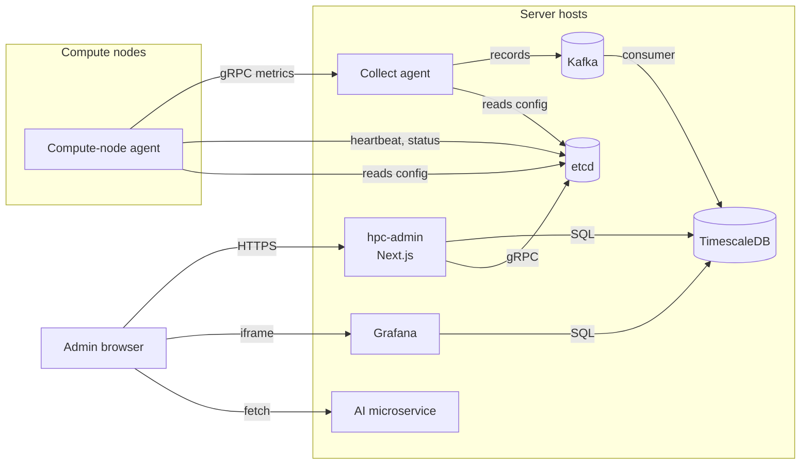
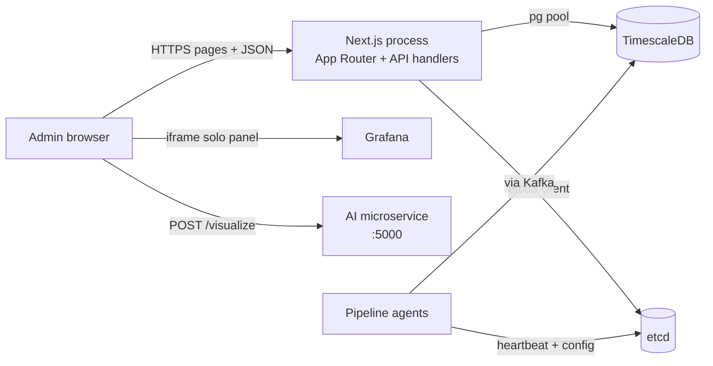
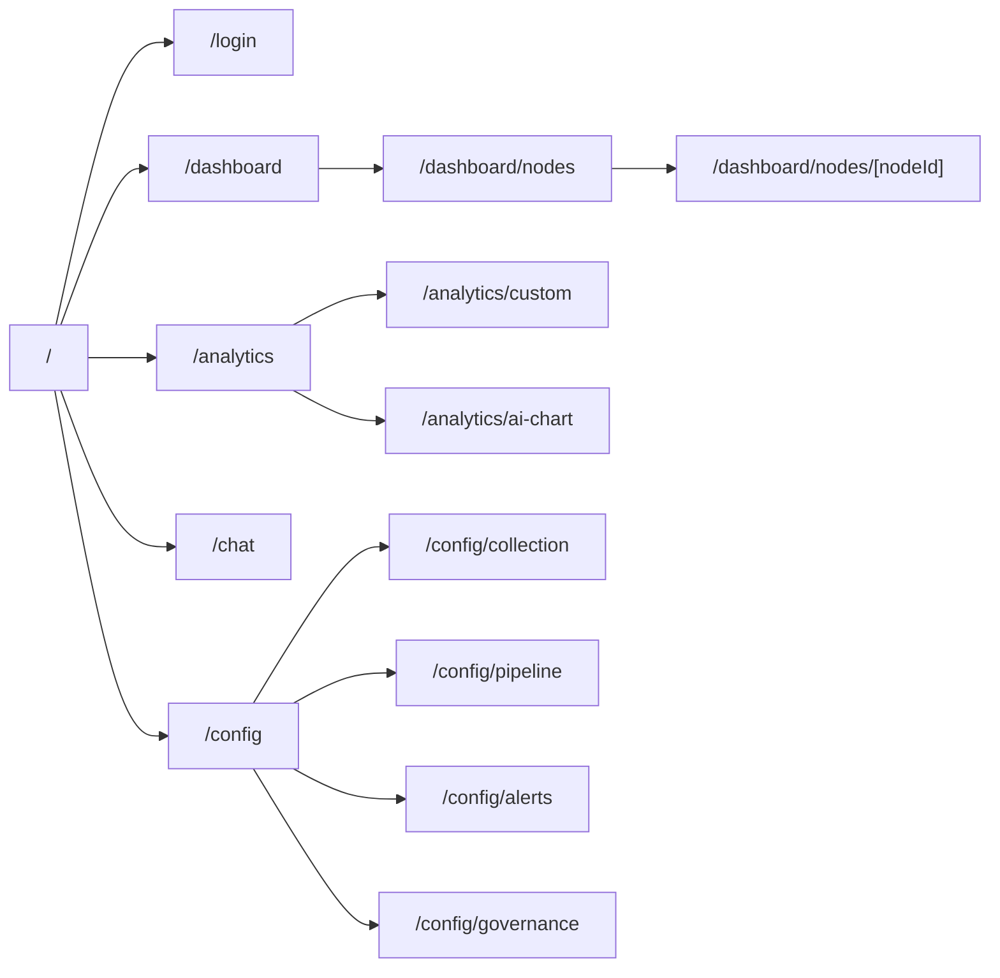
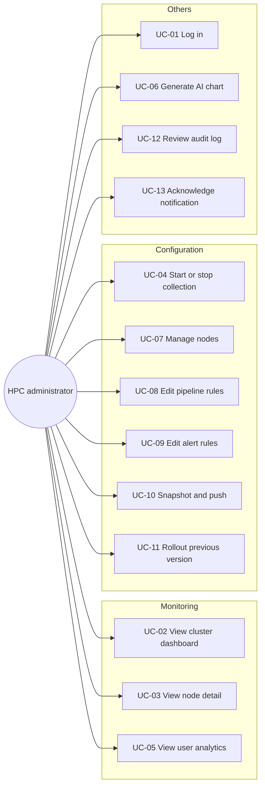
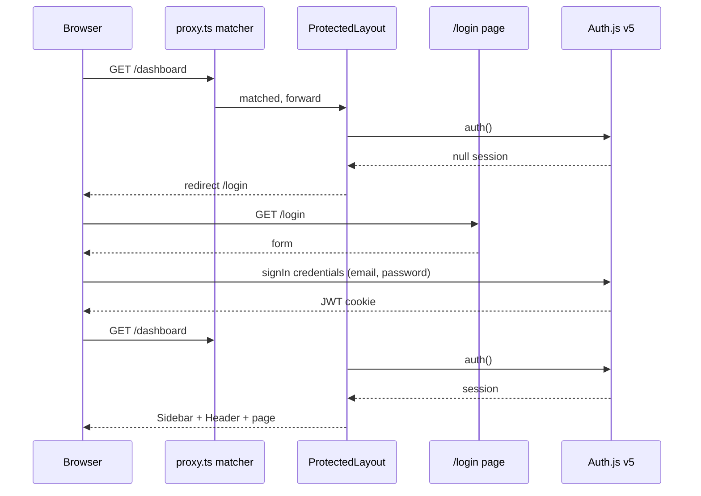
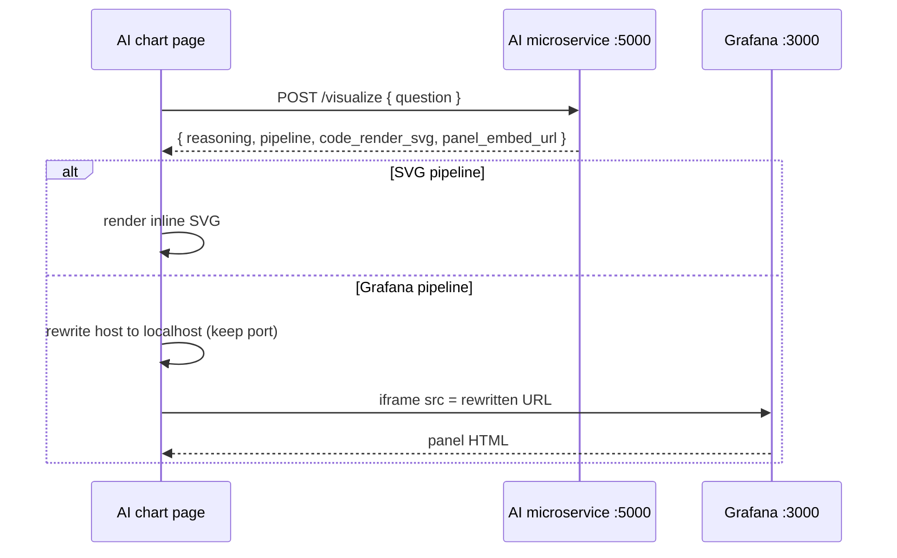
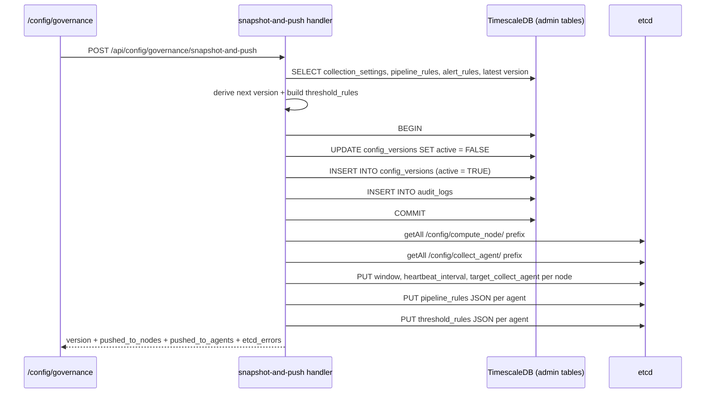
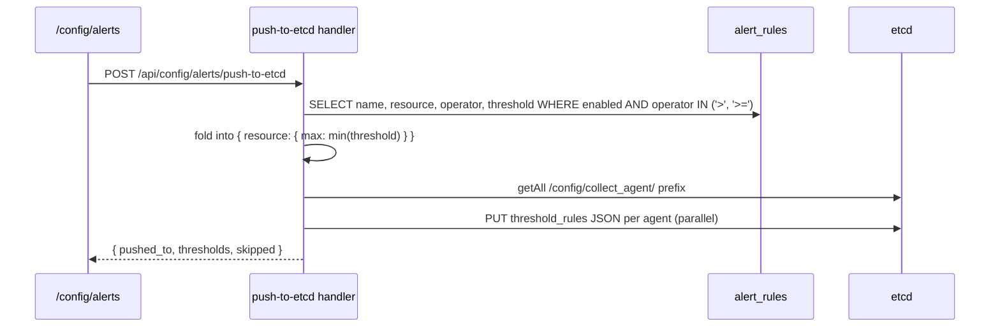
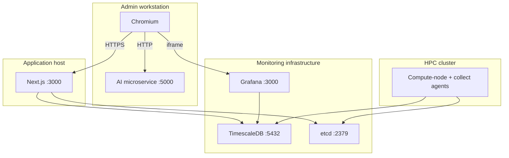

# Diagrams

> All diagrams are authored in Mermaid so they can be reviewed in the browser. Before the final thesis submission, render each one to SVG or PNG and place it in the thesis template.

## System context

Shows how the admin application sits inside the wider HPC monitoring system. Referenced from Chapter 2 §2.1.



## High-level architecture

Referenced from Chapter 3 §3.2.



## Layered decomposition

Referenced from Chapter 3 §3.3.

```mermaid
flowchart TB
    subgraph presentation [Presentation]
        pages[src/app/\(auth\) + \(protected\)]
        comps[src/components]
    end
    subgraph api [API layer]
        handlers[src/app/api/**/route.ts]
    end
    subgraph integration [Integration]
        db[src/lib/db.ts]
        etcd[src/lib/etcd.ts]
        types[src/types/index.ts]
    end
    subgraph data [Data]
        adminTables[nodes, users, rules, versions, audit]
        hyper[node_status_hourly<br/>user_app_hourly]
    end

    pages -->|fetch JSON| handlers
    comps -->|props| pages
    handlers -->|pool.connect| db
    handlers -->|etcd3| etcd
    handlers -.types.-> types
    db --> adminTables
    db --> hyper
    etcd --> etcdStore[(etcd keys)]
```

## Route tree

Referenced from Chapter 3 §3.4.



## Entity-relationship diagram

Admin-owned tables plus the two pipeline-owned hypertables. Referenced from Chapter 3 §3.5.

```mermaid
erDiagram
    nodes ||--o| collection_settings : "1:0..1"
    nodes ||--o{ notifications : "0..N"
    alert_rules ||--o{ notifications : "0..N"
    hpc_users ||--o{ user_app_hourly : "0..N"
    nodes ||--o{ node_status_hourly : "0..N"
    nodes ||--o{ user_app_hourly : "0..N"

    nodes {
      TEXT id PK
      TEXT name
      TEXT ip
      TEXT group_name
      TEXT collect_agent
      TIMESTAMPTZ created_at
    }
    hpc_users {
      INT uid PK
      TEXT username
      TEXT email
      TEXT group_name
    }
    collection_settings {
      TEXT node_id PK_FK
      INT interval_seconds
      INT window_seconds
      TEXT collect_agent
      TIMESTAMPTZ updated_at
    }
    pipeline_rules {
      TEXT id PK
      TEXT name
      TEXT type
      TEXT resource
      TEXT condition
      BOOLEAN enabled
    }
    alert_rules {
      TEXT id PK
      TEXT name
      TEXT node_group
      TEXT resource
      TEXT operator
      DOUBLE threshold
      TEXT severity
      BOOLEAN enabled
    }
    notifications {
      TEXT id PK
      TEXT rule_id FK
      TEXT severity
      TEXT message
      TEXT node_id FK
      BOOLEAN acknowledged
      TIMESTAMPTZ created_at
    }
    config_versions {
      TEXT id PK
      TEXT version
      TEXT author
      TEXT description
      JSONB config_snapshot
      BOOLEAN active
      TIMESTAMPTZ created_at
    }
    audit_logs {
      TEXT id PK
      TEXT actor
      TEXT action
      TEXT target
      TEXT detail
      TIMESTAMPTZ created_at
    }
    custom_dashboards {
      TEXT id PK
      TEXT title
      INT_ARRAY user_uids
      TEXT resource
      TEXT chart_type
      BOOLEAN pinned
    }
    node_status_hourly {
      TIMESTAMPTZ bucket_time
      TEXT node_id
      DOUBLE avg_cpu_usage_percent
      DOUBLE avg_gpu_utilization
      DOUBLE avg_mem_usage_percent
      BIGINT max_mem_used_bytes
      BIGINT total_disk_read_bytes
      BIGINT total_disk_write_bytes
      BIGINT total_net_rx_bytes
      BIGINT total_net_tx_bytes
      BOOLEAN is_active
    }
    user_app_hourly {
      TIMESTAMPTZ bucket_time
      TEXT node_id
      INT uid
      TEXT comm
      DOUBLE total_cpu_time_seconds
      BIGINT max_rss_memory_bytes
      INT max_gpu_memory_mib
      BIGINT total_read_bytes
      BIGINT total_write_bytes
      BIGINT total_net_rx_bytes
      BIGINT total_net_tx_bytes
      INT process_count
    }
```

## Use case diagram

Referenced from Chapter 2 §2.5.



## Login sequence

Referenced from Chapter 2 §2.5 UC-01.



## AI chart generation sequence

Referenced from Chapter 3 §3.9.2 and Chapter 4 §4.10.



## Snapshot-and-push sequence

Referenced from Chapter 3 §3.10 and Chapter 4 §4.8.



## Push-alerts-to-etcd sequence

Referenced from Chapter 4 §4.8.



## Deployment diagram

Single-host deployment used for the thesis demo. Referenced from Chapter 4 §4.1 and Chapter 6 §6.3.


