# HPC Admin Web Application — Software Report

**Project:** `hpc-admin` — an administrative web console for an HPC monitoring pipeline
**Stack:** Next.js 16 · TypeScript · Auth.js v5 · Tailwind CSS v4 · PostgreSQL/TimescaleDB · etcd · Grafana

---

## Table of Contents

- [Chapter 1 — Introduction](#chapter-1--introduction)
- [Chapter 2 — System Analysis](#chapter-2--system-analysis)
- [Chapter 3 — Architecture and Design](#chapter-3--architecture-and-design)
- [Chapter 4 — Implementation](#chapter-4--implementation)
- [Chapter 5 — Testing](#chapter-5--testing)
- [Chapter 6 — Conclusion and Future Work](#chapter-6--conclusion-and-future-work)
- [Appendix A — API Endpoint Catalogue](#appendix-a--api-endpoint-catalogue)
- [Appendix B — etcd Key Reference](#appendix-b--etcd-key-reference)
- [Appendix C — Database DDL](#appendix-c--database-ddl)
- [Appendix D — Screenshots](#appendix-d--screenshots)

---

# Chapter 1 — Introduction

## 1.1 Context

High-performance computing (HPC) clusters are shared facilities that host large numbers of compute-intensive workloads — scientific simulations, machine learning training jobs, data-analysis pipelines — on behalf of many users simultaneously. To keep such a cluster healthy, administrators must continuously observe the resources it consumes: CPU load, memory pressure, GPU utilization, disk and network throughput. Continuous observation is necessary for three distinct reasons.

1. **Operational awareness.** Nodes fail, jobs crash, and collection agents lose connectivity. Without a live view of every node an administrator cannot react in time.
2. **Historical accountability.** To plan capacity, investigate anomalies, or bill user groups fairly, an administrator needs historical data per node, per application, and per user, stored at a resolution that supports drill-down.
3. **Configuration governance.** The data-collection pipeline itself must be tunable — sampling windows, heartbeat intervals, filtering and aggregation rules, alert thresholds — and every change must be auditable.

In the thesis project, the pipeline that *produces* the metrics (compute-node agents, collect agents, Kafka broker, TimescaleDB, etcd for live configuration, Grafana for visualization) is already built as a separate subsystem `monitor-data-pipeline`. This report documents the **administrative web application** that *consumes and controls* that pipeline: `Application/hpc-admin`.

## 1.2 Problem statement

Before this application existed, administrators of the cluster had to:

- open Grafana directly to see real-time panels, with no higher-level context;
- run ad-hoc SQL against TimescaleDB to answer questions such as *"which user consumed the most GPU memory last week?"*;
- edit etcd keys by hand with `etcdctl` to change a collection window or an alert threshold;
- keep no record of *who* changed *what*, *when*, or *why*.

In other words, there was a functional data pipeline but no single pane of glass to operate it. The administrator's experience was fragmented and error-prone, and changes to pipeline configuration were neither validated nor auditable.

The goal of this thesis is therefore to design and build a web-based administrative console that unifies real-time monitoring, historical analytics, AI-assisted exploration, and dynamic configuration of the HPC monitoring pipeline, while being safe to operate and easy to extend.

## 1.3 Objectives

The application must deliver four product-level capabilities, each mapped to a chapter of requirements in Chapter 2:

1. **Real-time resource monitoring** at cluster and per-node level by embedding the existing Grafana panels inside the admin UI.
2. **Historical usage tracking** at three levels of aggregation — node, application, and user — over data already stored in TimescaleDB hypertables.
3. **AI-assisted charting**: accept a natural-language question from the administrator and return either a generated chart or an embedded Grafana panel, by delegating to a separate AI microservice built as part of the same thesis work.
4. **Dynamic pipeline configuration**: edit node cluster membership (which node reports to which collect agent), collection intervals, pre-processing rules (filter / aggregate / derive), and alert thresholds, with versioning, audit logs, and safe rollout to etcd.

Supporting (non-functional) objectives:

- Single administrator role for now, with an architecture that is straightforward to extend to RBAC later.
- Type-safe stack (TypeScript end to end) for maintainability.
- Honest handling of external failures (etcd or AI service down): the UI must degrade gracefully rather than crash.

## 1.4 Scope

**In scope** (documented in this report):

- The Next.js 16 application at `Application/hpc-admin`, including:
  - the front-end pages under `src/app/(auth)` and `src/app/(protected)`,
  - the API routes under `src/app/api`,
  - the database schema under `db/schema.sql` for the admin-owned tables,
  - the integration with TimescaleDB (read-only for analytics), etcd (read/write for live pipeline configuration), Grafana (iframe embedding), and the AI microservice.

**Out of scope** (mentioned only as context):

- The Python data pipeline (`monitor-data-pipeline/compute-node-agent`, `monitor-data-pipeline/collect-agent`, Kafka, etcd server setup). Its responsibilities are summarised in Chapter 2 §2.1 and otherwise treated as a black box.
- The internals of the AI microservice that the application calls at `http://localhost:5000/visualize`. It is also part of the author's thesis work but is documented elsewhere; this report describes only the integration contract (request/response, sequence) in Chapter 3 §3.9 and Chapter 4 §4.10.
- The Grafana dashboard design itself; the application only embeds existing panels.

## 1.5 Methodology

The application was developed iteratively in four phases that correspond one-to-one with the remaining chapters:

1. **Requirement analysis** — the environment, stakeholders, functional and non-functional requirements, and use cases were written down first. This produced the catalogue in Chapter 2.
2. **Design** — technology stack decisions, the high-level architecture, the data model, the etcd key schema, and the API contract were fixed before any code was written. This produced Chapter 3.
3. **Implementation** — the code was built module by module, with the order following the data-flow direction (data layer → API routes → pages). Commit history shows the incremental build. This produced Chapter 4.
4. **Testing** — the testing strategy (unit, integration, end-to-end, manual, non-functional) was designed around the use-case catalogue, with the intent to execute before defense. This produced Chapter 5.

No formal methodology framework (Scrum, Kanban) was imposed because the team size is one; however, the four phases mirror the analysis–design–implementation–testing loop of a classical waterfall plus the continuous small iterations typical of solo development.

## 1.6 Report structure

- **Chapter 2 — System Analysis.** Actors, environment, functional and non-functional requirements, use cases, requirements traceability.
- **Chapter 3 — Architecture and Design.** Technology stack choices, layered architecture, data model, etcd key schema, API design, security, external integrations, configuration governance.
- **Chapter 4 — Implementation.** Module-by-module walkthrough of the code: bootstrap, authentication, data layer, node registry, live pipeline configuration, analytics, real-time monitoring, configuration management, notifications, AI chart integration, chat, styling, cross-cutting concerns.
- **Chapter 5 — Testing.** Proposed test pyramid (unit, integration, end-to-end, manual, non-functional), tooling, environment, test case template, results template.
- **Chapter 6 — Conclusion and Future Work.** Summary of contributions, honest limitations, future work, personal reflection.
- **Appendices.** API endpoint catalogue, etcd key reference, database DDL, screenshots per page.

---

# Chapter 2 — System Analysis

## 2.1 Environment and related components

The admin web application is one node in a larger monitoring system that the author also built as part of the thesis (separate subsystem `monitor-data-pipeline`). The rest of the system is treated as **environment** in this report: its behaviour is assumed, not documented.

The pipeline runs on every compute node and produces time-series metrics at two levels of aggregation:

- A **compute-node agent** (Python + eBPF, requires root) samples CPU, memory, GPU, disk, and network activity per process and sends gRPC messages to its configured collect agent. It reads its own configuration (collection window, heartbeat interval, target collect agent, running/stopped status) from **etcd** under `/config/compute_node/{nodeId}/...` and publishes its own heartbeat at `/nodes/{nodeId}/heartbeat`.
- A **collect agent** (Python, asyncio) receives gRPC messages from multiple compute nodes, runs a small processing pipeline (schema validation → filtering → enrichment → threshold checks → configurable aggregation), then publishes records to **Kafka**. Its configuration (Kafka brokers, topic, gRPC port, threshold rules, pipeline rules) also lives in etcd under `/config/collect_agent/{agentId}/...`.
- Kafka consumers (outside the scope of this thesis) persist the aggregated records into two TimescaleDB hypertables, `node_status_hourly` and `user_app_hourly`.
- **Grafana** reads from the same TimescaleDB and exposes dashboards that the admin application embeds through solo-panel iframes.

The admin application therefore never talks to the agents directly. It communicates through three stable boundaries:

| Boundary | Direction | Purpose |
|---|---|---|
| TimescaleDB | read only | historical analytics, latest metrics per node |
| etcd | read + write | live pipeline configuration and node status |
| Grafana | embedded iframe | real-time panels |

The system-context diagram below shows how the admin application sits inside the wider HPC monitoring system:

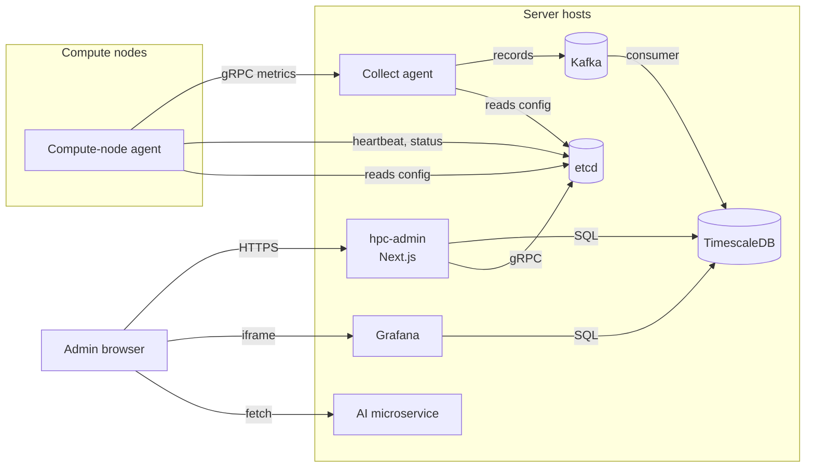

## 2.2 Stakeholders and actors

### Primary actor

**HPC administrator.** A single human role in the current version. The credentials provider in [src/auth.ts](../src/auth.ts) compares the submitted email/password against the environment variables `ADMIN_EMAIL` and `ADMIN_PASSWORD` — there is exactly one account. The architecture does not preclude multiple accounts or role-based access control; that is tracked as future work in Chapter 6.

### Secondary actors (systems)

| Actor | Role for this application |
|---|---|
| TimescaleDB | source of historical metrics (`node_status_hourly`, `user_app_hourly`) and home of the admin-owned tables (`nodes`, `hpc_users`, `collection_settings`, `pipeline_rules`, `alert_rules`, `notifications`, `config_versions`, `audit_logs`, `custom_dashboards`). |
| etcd | source of live pipeline configuration and heartbeats; also the destination of configuration writes made through the admin UI. |
| Grafana | visualizer of real-time metrics. The admin app embeds solo panels with a URL template documented in Chapter 3. |
| AI microservice | external HTTP service reachable at `http://localhost:5000/visualize`, responsible for turning natural-language questions into either an SVG chart or a Grafana embed URL. Built by the author but out of scope for this report. |

## 2.3 Functional requirements

The functional requirements are grouped by the four product goals from §1.3.

### FR-1. Real-time monitoring (Grafana embedding)

- **FR-1.1** The cluster dashboard shall embed a configurable set of cluster-level Grafana solo panels (CPU, memory, GPU, disk, network) with a user-selectable time range (1h / 6h / 24h).
- **FR-1.2** The node detail page shall embed per-node Grafana solo panels for the same set of resources, scoped via `var-node={nodeId}`.
- **FR-1.3** The cluster dashboard shall also show derived counters: total nodes, running nodes, stopped nodes, active alerts count.

### FR-2. Historical analytics

- **FR-2.1** The node list shall show, for each node, the last hourly bucket of CPU %, memory %, and GPU utilisation from `node_status_hourly`.
- **FR-2.2** The node detail page shall plot a chosen metric over a chosen range (24h / 48h / 7d / 30d) using Recharts over `node_status_hourly`.
- **FR-2.3** The user analytics page shall show, for a given date range, a summary of CPU seconds, peak memory, peak GPU memory, disk I/O, and network I/O per user from `user_app_hourly`.
- **FR-2.4** The user analytics page shall support drilling down to an individual user's time-series for a single resource.
- **FR-2.5** The user analytics page shall support a per-application breakdown (grouped by `comm`) across multiple selected users.
- **FR-2.6** All analytics queries shall use bind parameters only; resource names that feed aggregation expressions must come from an allow-list, never from interpolated user input.

### FR-3. AI-assisted charting

- **FR-3.1** The administrator shall be able to type a natural-language question and receive, in the same page, either a rendered SVG chart or an embedded Grafana panel that answers it.
- **FR-3.2** The admin application shall delegate question understanding and chart selection to the external AI microservice at `http://localhost:5000/visualize` and must tolerate network failure of that service (clear error message, no crash).
- **FR-3.3** When the AI microservice returns a remote Grafana URL, the admin application shall rewrite the host to `localhost` so that the iframe works inside the browser environment the administrator uses.

### FR-4. Dynamic configuration

Node registry:

- **FR-4.1** CRUD on the `nodes` table (id, name, ip, group, default collect agent).
- **FR-4.2** For each registered node, the administrator can create or update its live configuration in etcd (`target_collect_agent`, `window`, `heartbeat_interval`).
- **FR-4.3** The administrator can start or stop data collection on a node by toggling `/config/compute_node/{nodeId}/status` between `running` and `stopped`.

Collection settings:

- **FR-4.4** A screen lists every node with its current collection settings merged from `nodes` and `collection_settings`; editing a node's settings writes to both the DB and the corresponding etcd keys.

Pipeline rules and alerts:

- **FR-4.5** CRUD on `pipeline_rules` (filter / aggregate / derive on a resource) and on `alert_rules` (per-group threshold with severity).
- **FR-4.6** A "push to etcd" action writes all enabled pipeline rules as a JSON array under `/config/collect_agent/{agentId}/pipeline_rules` for every discovered agent.
- **FR-4.7** A similar action writes alert thresholds as a JSON object under `/config/collect_agent/{agentId}/threshold_rules`, with operator `>` / `>=` rules aggregated into per-resource minimums.

Governance:

- **FR-4.8** A *snapshot-and-push* action gathers the current DB state (collection settings + pipeline rules + threshold rules), auto-increments a semantic version, stores the JSON snapshot in `config_versions` (marked active), deactivates other versions, writes an `audit_logs` entry, and pushes the derived configuration to every discovered node and agent in etcd in a single transaction.
- **FR-4.9** A *rollout* action replays a saved snapshot back into etcd.
- **FR-4.10** Every administrator action affecting configuration shall be recorded in `audit_logs`.

Notifications:

- **FR-4.11** The notifications panel lists alert instances (`notifications` table, joined with `nodes` for readability) and allows acknowledging each one.

## 2.4 Non-functional requirements

| Category | Requirement |
|---|---|
| Usability | Dark-themed UI consistent with modern admin dashboards; all destructive actions confirmed; loading and empty states present on every page. |
| Performance | API p95 under 500 ms for analytics endpoints on a dataset of up to one year of hourly buckets. Grafana iframes load asynchronously and do not block the rest of the UI. |
| Availability | Single-instance deployment acceptable for the thesis; if etcd or the AI microservice is unreachable, the affected page shall degrade gracefully (show an error banner, keep other features usable). |
| Security | Every page except `/login` requires an authenticated session. Every SQL query uses bind parameters. No secret is shipped to the client. |
| Maintainability | TypeScript end-to-end; shared types in `src/types/index.ts`; single database pool (`src/lib/db.ts`) and etcd client (`src/lib/etcd.ts`); no `tailwind.config.ts` — theme tokens in `globals.css`. |
| Observability | Server-side console logs on every API error; future work to add structured logs and OpenTelemetry (see Chapter 6). |
| Extensibility | Route-group strategy and co-located API handlers make it straightforward to add new modules without touching existing ones. |

## 2.5 Use case catalogue

The use-case diagram below summarises the actor-to-use-case relationships. Textual use cases follow the template *ID / actor / trigger / preconditions / main flow / alternative flows / postconditions*.

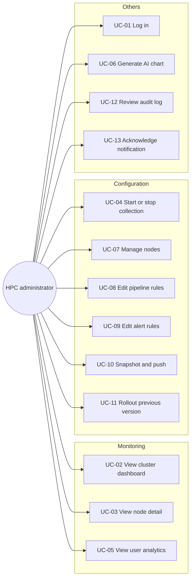

| ID | Title | Actor |
|---|---|---|
| UC-01 | Log in | Administrator |
| UC-02 | View cluster dashboard | Administrator |
| UC-03 | View node detail | Administrator |
| UC-04 | Start / stop data collection on a node | Administrator |
| UC-05 | View user usage analytics | Administrator |
| UC-06 | Generate a chart from a natural-language question | Administrator |
| UC-07 | Manage nodes (CRUD) | Administrator |
| UC-08 | Edit pipeline rules and push to etcd | Administrator |
| UC-09 | Edit alert rules and push thresholds to etcd | Administrator |
| UC-10 | Snapshot current configuration and push as a new version | Administrator |
| UC-11 | Roll back to a previous configuration version | Administrator |
| UC-12 | Review the audit log | Administrator |
| UC-13 | Acknowledge a notification | Administrator |

### UC-01 Log in (fully written example)

- **Trigger:** the administrator opens any URL of the application.
- **Preconditions:** the `ADMIN_EMAIL` and `ADMIN_PASSWORD` environment variables are set on the server.
- **Main flow:**
  1. The `src/proxy.ts` matcher intercepts the request because the path is neither `/login` nor `/api/auth/*`.
  2. The protected layout at [src/app/(protected)/layout.tsx](../src/app/(protected)/layout.tsx) calls `auth()`; if there is no session the user is redirected to `/login`.
  3. The administrator enters email and password; the client calls `signIn("credentials", { email, password, redirect: false })`.
  4. If the credentials match, `authorize` in [src/auth.ts](../src/auth.ts) returns a user object; NextAuth creates a JWT session.
  5. The browser is redirected to `/dashboard`.
- **Alternative flow:** if the credentials do not match, an in-page error is shown and no session is created.
- **Postconditions:** the administrator has a JWT session cookie and can reach any `(protected)` page.

The login sequence is depicted below.

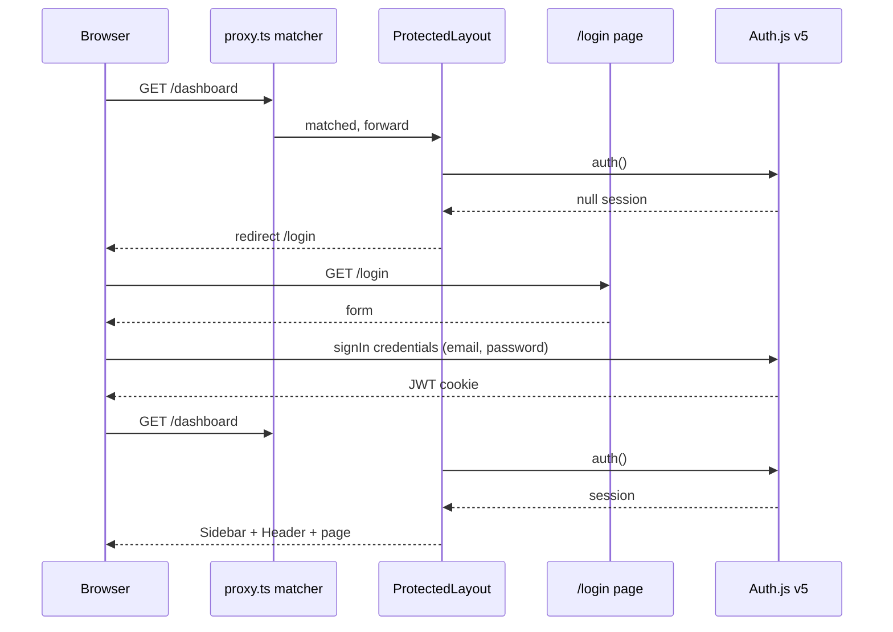

> **[SCREENSHOT: Login page — empty form and inline error state when credentials are invalid]**

The remaining use cases (UC-02 … UC-13) shall follow the same template and sit alongside this one in the final thesis; stubs are provided as bullet points above.

## 2.6 Requirements traceability

The table below maps every functional requirement to the module in Chapter 4 that realises it. It is also used as the basis for the test plan in Chapter 5 (every FR must have at least one positive and one negative test case).

| FR | Module (Chapter 4 §) | API routes | Page(s) |
|---|---|---|---|
| FR-1.1 | §4.7 Grafana embedding | — | `/dashboard` |
| FR-1.2 | §4.7 | — | `/dashboard/nodes/[nodeId]` |
| FR-1.3 | §4.6 Analytics | `/api/analytics/cluster-stats`, `/api/etcd/nodes` | `/dashboard` |
| FR-2.1 | §4.4 Node registry | `/api/nodes/metrics/latest` | `/dashboard/nodes` |
| FR-2.2 | §4.4 | `/api/nodes/[nodeId]/hourly` | `/dashboard/nodes/[nodeId]` |
| FR-2.3 to 2.5 | §4.6 | `/api/analytics/user-usage` | `/analytics` |
| FR-2.6 | §4.6 (SQL allow-list) | same | same |
| FR-3.1 to 3.3 | §4.10 AI chart | external `:5000/visualize` | `/analytics/ai-chart` |
| FR-4.1 | §4.4 | `/api/nodes`, `/api/nodes/[nodeId]` | `/dashboard/nodes` |
| FR-4.2 | §4.5 etcd module | `/api/etcd/nodes`, `/api/etcd/nodes/[nodeId]` | `/config/collection` |
| FR-4.3 | §4.5 | `/api/etcd/nodes/[nodeId]/status` | `/dashboard/nodes/[nodeId]`, `/config/collection` |
| FR-4.4 | §4.8 Config | `/api/config/collection`, `/api/config/collection/[nodeId]` | `/config/collection` |
| FR-4.5 | §4.8 | `/api/config/pipeline`, `/api/config/alerts` (+ `[id]`) | `/config/pipeline`, `/config/alerts` |
| FR-4.6 | §4.8 | `/api/config/pipeline/push-to-etcd` | `/config/pipeline` |
| FR-4.7 | §4.8 | `/api/config/alerts/push-to-etcd` | `/config/alerts` |
| FR-4.8 | §4.8 Governance | `/api/config/governance/snapshot-and-push` | `/config/governance` |
| FR-4.9 | §4.8 | `/api/config/governance/rollout` | `/config/governance` |
| FR-4.10 | §4.8 | `/api/config/governance/audit` | `/config/governance` |
| FR-4.11 | §4.9 Notifications | `/api/notifications`, `/api/notifications/[id]` | sidebar panel + dashboard |

---

# Chapter 3 — Architecture and Design

## 3.1 Technology stack decisions

The stack was chosen for four reasons that run through every decision: (a) a single language (TypeScript) end-to-end to reduce integration friction; (b) server and client under the same framework so route protection, data fetching, and UI are coherent; (c) minimal indirection over the database and etcd because both schemas are already well-defined by the pipeline; (d) reliance on the existing Grafana deployment rather than reimplementing charts for real-time data.

### 3.1.1 Next.js 16 (App Router) + TypeScript

Next.js 16 is used for both the UI and the API. The App Router gives three features that match the requirements directly:

- **File-based routing**, so every URL corresponds to a folder in `src/app`.
- **Route groups** such as `(auth)` and `(protected)`, which are used in §3.4 to model authentication boundaries without changing URL paths.
- **Server components in layouts**, which let the protected layout check the session on the server before rendering any child page.

Two Next.js 16 specificities are important to document:

- Middleware was renamed to **proxy**. The file [src/proxy.ts](../src/proxy.ts) exports `{ auth as proxy }` and a `matcher`. A pre-16 tutorial would call this file `middleware.ts`.
- Dynamic route params are **Promises**: `const { id } = await params`. Every API route that uses `[param]` awaits it, e.g. [src/app/api/nodes/[nodeId]/route.ts](../src/app/api/nodes/[nodeId]/route.ts).

### 3.1.2 Auth.js v5 (next-auth@beta) with credentials + JWT

Auth.js v5 is used because (a) it is the official authentication library recommended by the Next.js team for App Router; (b) it exposes a simple `auth()` function that returns the current session in server components; (c) a JWT-session strategy means no server-side session store is needed. A credentials provider is sufficient for the single-admin scenario specified in Chapter 2; SSO / OIDC is listed in future work.

### 3.1.3 Tailwind CSS v4 with theme-in-CSS

Tailwind v4 is used without a `tailwind.config.ts`. The theme tokens (colour palette `#0d1117`, `#161b22`, `#1c2128`, `#30363d`, `#58a6ff`, etc.) are declared inside the `@theme` block of [src/app/globals.css](../src/app/globals.css). This keeps the visual identity in one place and removes the need for a compile-time JS config.

### 3.1.4 PostgreSQL / TimescaleDB via `pg` pool

The application talks to TimescaleDB directly through `pg` (`node-postgres`), without an ORM. The rationale is:

- The analytics queries lean heavily on TimescaleDB-specific SQL (`time_bucket`, `DISTINCT ON`, hypertables), which ORMs abstract away awkwardly.
- The admin tables are few and simple (nine tables) and CRUD can be expressed in one-screen SQL.
- A single shared `Pool` at [src/lib/db.ts](../src/lib/db.ts) avoids connection exhaustion: every API route does `pool.connect()` and releases in a `finally` block.

### 3.1.5 etcd3 client

Live pipeline configuration uses etcd because the compute-node and collect agents already watch their own keys there; writing through a separate indirection would only add latency. [src/lib/etcd.ts](../src/lib/etcd.ts) creates one shared `Etcd3` client (v3 gRPC protocol) and every API route imports it.

### 3.1.6 Recharts for analytics, Grafana iframe for real-time

Recharts is used on pages where the application owns the data (`/analytics`, `/dashboard/nodes/[nodeId]`). Real-time cluster and per-node panels are owned by Grafana and embedded via `iframe` using the solo-dashboard URL pattern documented in §3.9.1. Not duplicating Grafana's chart work is a deliberate scope decision.

### 3.1.7 Summary of dependencies

From [package.json](../package.json), the runtime dependencies are limited and intentional:

| Package | Version | Purpose |
|---|---|---|
| `next` | 16.1.6 | framework |
| `react`, `react-dom` | 19.2.3 | UI |
| `next-auth` | 5.0.0-beta.x | authentication |
| `pg` | ^8.18.0 | PostgreSQL / TimescaleDB driver |
| `etcd3` | ^1.1.2 | etcd v3 client |
| `recharts` | ^3.7.0 | analytics charts |
| `tailwindcss` | v4 | styling |

No AI SDK is imported at runtime because the AI microservice is a separate process reached over HTTP (see §3.9.2).

## 3.2 High-level architecture

Four facts about the runtime system are worth emphasising:

1. The browser is the only **active** client; all fetches originate from the admin's browser.
2. The Next.js server is a **single process** that serves both the HTML pages (App Router) and the JSON API (`/api/...`). There is no separate backend.
3. **Reads** flow from the Next.js server to TimescaleDB (SQL) or etcd (gRPC). **Writes** that affect the pipeline fan out to *both* TimescaleDB (for durable record and audit) and etcd (for live configuration).
4. The browser talks directly to **Grafana** via `iframe` because solo-dashboard URLs are public to anyone who can reach the Grafana server; and to the **AI microservice** via `fetch` to `http://localhost:5000/visualize` because both run on the admin's workstation in the current deployment.

The high-level component diagram is shown below.

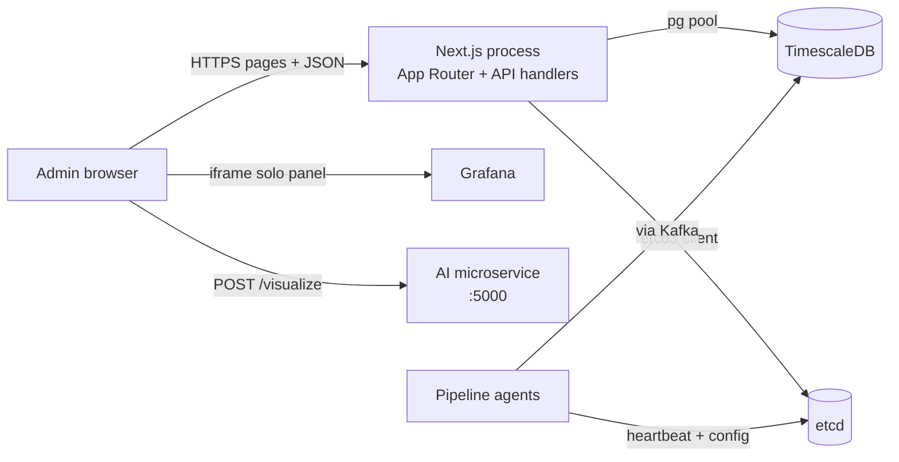

## 3.3 Layered decomposition

The application is organised into four layers, each with one directory in the repository.

| Layer | Directory | Responsibility |
|---|---|---|
| Presentation | [src/app/(auth)](../src/app/(auth)), [src/app/(protected)](../src/app/(protected)), [src/components](../src/components) | UI pages and reusable components. |
| API | [src/app/api](../src/app/api) | HTTP JSON handlers (Next.js route handlers). |
| Integration | [src/lib](../src/lib) | Singletons and helpers that talk to TimescaleDB, etcd, Grafana. |
| Data | [db/schema.sql](../db/schema.sql) + TimescaleDB hypertables | Relational schema owned by the application + pipeline-owned hypertables read only. |

Cross-cutting: [src/auth.ts](../src/auth.ts), [src/proxy.ts](../src/proxy.ts), [src/types/index.ts](../src/types/index.ts).

The layered decomposition and the imports between these layers are shown below.

```mermaid
flowchart TB
    subgraph presentation [Presentation]
        pages[src/app/\(auth\) + \(protected\)]
        comps[src/components]
    end
    subgraph api [API layer]
        handlers[src/app/api/**/route.ts]
    end
    subgraph integration [Integration]
        db[src/lib/db.ts]
        etcd[src/lib/etcd.ts]
        types[src/types/index.ts]
    end
    subgraph data [Data]
        adminTables[nodes, users, rules, versions, audit]
        hyper[node_status_hourly<br/>user_app_hourly]
    end

    pages -->|fetch JSON| handlers
    comps -->|props| pages
    handlers -->|pool.connect| db
    handlers -->|etcd3| etcd
    handlers -.types.-> types
    db --> adminTables
    db --> hyper
    etcd --> etcdStore[(etcd keys)]
```

## 3.4 Route and navigation design

### Route groups

Next.js route groups `(auth)` and `(protected)` carry no URL segment; they exist only to attach different layouts.

- `(auth)/login/page.tsx` is the only unauthenticated route.
- `(protected)/layout.tsx` wraps every admin page, calls `await auth()` and redirects to `/login` on null session, then renders the `Sidebar` and `Header` around `{children}`.

Code reference (unchanged, 19 lines):

```tsx
// Application/hpc-admin/src/app/(protected)/layout.tsx
import { auth } from "@/auth"
import { redirect } from "next/navigation"
import { Sidebar } from "@/components/layout/Sidebar"
import { Header } from "@/components/layout/Header"

export default async function ProtectedLayout({ children }: { children: React.ReactNode }) {
  const session = await auth()
  if (!session) redirect("/login")

  return (
    <div className="min-h-screen bg-[#0d1117]">
      <Sidebar />
      <Header />
      <main className="ml-60 pt-14 min-h-screen">
        {children}
      </main>
    </div>
  )
}
```

### Sidebar grouping

The sidebar groups routes into three sections that mirror the product goals from Chapter 2:

- **Monitoring** — Dashboard (`/dashboard`), Nodes (`/dashboard/nodes`), Analytics (`/analytics`).
- **Configuration** — Collection (`/config/collection`), Pipeline (`/config/pipeline`), Alerts (`/config/alerts`), Governance (`/config/governance`).
- **Assistance** — Chat (`/chat`), AI Chart (`/analytics/ai-chart`).

The full route tree is shown below.

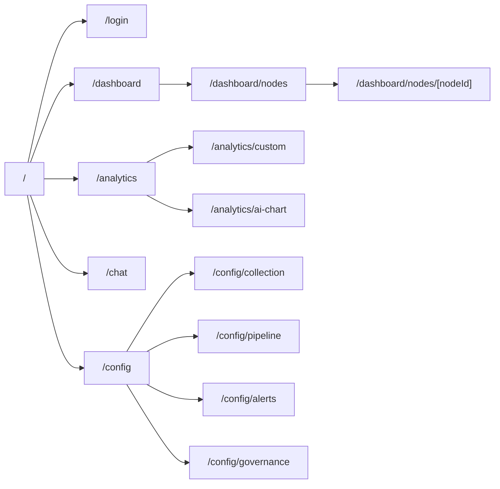

## 3.5 Data model

### Admin-owned tables (managed by the web app)

Defined in [db/schema.sql](../db/schema.sql):

| Table | Purpose |
|---|---|
| `nodes` | Compute-node registry (id, name, ip, group, default collect agent). |
| `hpc_users` | Cluster users for joining against `user_app_hourly.uid`. |
| `collection_settings` | Per-node override of interval/window/collect_agent (1:1 to `nodes`). |
| `pipeline_rules` | Named rules of type `filter` / `aggregate` / `derive` on a resource. |
| `alert_rules` | Threshold rules per node group, with operator and severity. |
| `notifications` | Alert instances (joined with `nodes` for display). |
| `config_versions` | Immutable JSON snapshots of configuration, at most one marked `active`. |
| `audit_logs` | Administrator actions of type `CREATE` / `UPDATE` / `DELETE` / `ROLLOUT` / `LOGIN`. |
| `custom_dashboards` | Saved chart definitions for the analytics custom-dashboard page. |

### Pipeline-owned hypertables (read-only for the web app)

| Hypertable | Primary key | Use |
|---|---|---|
| `node_status_hourly` | (`bucket_time`, `node_id`) | per-node hourly metrics. |
| `user_app_hourly` | (`bucket_time`, `node_id`, `uid`, `comm`) | per-user-per-application hourly metrics. |

Both are TimescaleDB hypertables with `bucket_time` as the time dimension. The admin application never writes to them.

The entity-relationship diagram for the admin-owned tables and the two pipeline-owned hypertables is shown below.

```mermaid
erDiagram
    nodes ||--o| collection_settings : "1:0..1"
    nodes ||--o{ notifications : "0..N"
    alert_rules ||--o{ notifications : "0..N"
    hpc_users ||--o{ user_app_hourly : "0..N"
    nodes ||--o{ node_status_hourly : "0..N"
    nodes ||--o{ user_app_hourly : "0..N"

    nodes {
      TEXT id PK
      TEXT name
      TEXT ip
      TEXT group_name
      TEXT collect_agent
      TIMESTAMPTZ created_at
    }
    hpc_users {
      INT uid PK
      TEXT username
      TEXT email
      TEXT group_name
    }
    collection_settings {
      TEXT node_id PK_FK
      INT interval_seconds
      INT window_seconds
      TEXT collect_agent
      TIMESTAMPTZ updated_at
    }
    pipeline_rules {
      TEXT id PK
      TEXT name
      TEXT type
      TEXT resource
      TEXT condition
      BOOLEAN enabled
    }
    alert_rules {
      TEXT id PK
      TEXT name
      TEXT node_group
      TEXT resource
      TEXT operator
      DOUBLE threshold
      TEXT severity
      BOOLEAN enabled
    }
    notifications {
      TEXT id PK
      TEXT rule_id FK
      TEXT severity
      TEXT message
      TEXT node_id FK
      BOOLEAN acknowledged
      TIMESTAMPTZ created_at
    }
    config_versions {
      TEXT id PK
      TEXT version
      TEXT author
      TEXT description
      JSONB config_snapshot
      BOOLEAN active
      TIMESTAMPTZ created_at
    }
    audit_logs {
      TEXT id PK
      TEXT actor
      TEXT action
      TEXT target
      TEXT detail
      TIMESTAMPTZ created_at
    }
    custom_dashboards {
      TEXT id PK
      TEXT title
      INT_ARRAY user_uids
      TEXT resource
      TEXT chart_type
      BOOLEAN pinned
    }
    node_status_hourly {
      TIMESTAMPTZ bucket_time
      TEXT node_id
      DOUBLE avg_cpu_usage_percent
      DOUBLE avg_gpu_utilization
      DOUBLE avg_mem_usage_percent
      BIGINT max_mem_used_bytes
      BIGINT total_disk_read_bytes
      BIGINT total_disk_write_bytes
      BIGINT total_net_rx_bytes
      BIGINT total_net_tx_bytes
      BOOLEAN is_active
    }
    user_app_hourly {
      TIMESTAMPTZ bucket_time
      TEXT node_id
      INT uid
      TEXT comm
      DOUBLE total_cpu_time_seconds
      BIGINT max_rss_memory_bytes
      INT max_gpu_memory_mib
      BIGINT total_read_bytes
      BIGINT total_write_bytes
      BIGINT total_net_rx_bytes
      BIGINT total_net_tx_bytes
      INT process_count
    }
```

## 3.6 etcd key schema

The admin application adopts the schema that the pipeline already defines. The table below lists every key *that the application reads or writes*.

### Compute-node scope

| Key | Direction | Purpose |
|---|---|---|
| `/config/compute_node/{nodeId}/target_collect_agent` | read/write | IP:port of the collect agent the node must send gRPC to. |
| `/config/compute_node/{nodeId}/window` | read/write | sampling window in seconds. |
| `/config/compute_node/{nodeId}/heartbeat_interval` | read/write | heartbeat cadence in seconds. |
| `/config/compute_node/{nodeId}/status` | read/write | `running` or `stopped`. |
| `/nodes/{nodeId}/heartbeat` | read only | JSON `{ timestamp, status, collection_active }` written by the agent. |

### Collect-agent scope

| Key | Direction | Purpose |
|---|---|---|
| `/config/collect_agent/{agentId}/kafka_brokers` | read/write | JSON array of brokers. |
| `/config/collect_agent/{agentId}/kafka_topic` | read/write | Kafka topic name. |
| `/config/collect_agent/{agentId}/pipeline_stages` | read/write | JSON array of processing-stage names the agent instantiates on startup. |
| `/config/collect_agent/{agentId}/process_fields` | read/write | JSON array — allow-list of per-process fields retained after `field_projection`. |
| `/config/collect_agent/{agentId}/comm_prefixes` | read/write | JSON array — process-name prefixes folded by `prefix_aggregation`. |
| `/config/collect_agent/{agentId}/threshold_rules` | read/write | JSON object derived from `alert_rules`, consumed by the `threshold_checker` stage. |

The admin application currently writes only a subset of these keys (`kafka_brokers`, `kafka_topic`, `threshold_rules`) plus a legacy `pipeline_rules` array that the agent does not read. Appendix B documents every key the agent reads, and Chapter 6 §6.3 tracks the work to bring the push handler in line with this schema.

### Node status derivation

Node status is **not** stored as a simple boolean. It is derived at read time from the heartbeat:

```
threshold = heartbeat_interval * 3      // default 20s × 3 = 60s
isAlive = heartbeat.status == "alive"
         && now - heartbeat.timestamp <= threshold
node.status = isAlive ? "running" : "stopped"
```

This derivation lives in [src/app/api/etcd/nodes/route.ts](../src/app/api/etcd/nodes/route.ts). The rationale is that the administrator cares about *observed liveness*, not *configured intent*, and heartbeats are the authoritative signal.

## 3.7 API design principles

Five conventions are applied uniformly across the 30 API routes.

1. **REST over JSON** with file-based routing. Each folder under `src/app/api` maps to a URL, and each `route.ts` exports named `GET`, `POST`, `PUT`, `DELETE` functions.
2. **Reads go to TimescaleDB** (registry + analytics), **writes that affect the pipeline go to both the DB and etcd**. The DB is the source of truth for versioning and audit; etcd receives a *projection* of the active configuration.
3. **Bind parameters always**, allow-lists never interpolated. For analytics, resource names (`cpu`, `mem`, `gpu`, `disk`, `net`) are mapped to hard-coded SQL expressions:

   ```ts
   // Application/hpc-admin/src/app/api/analytics/user-usage/route.ts
   // Hardcoded SQL expressions per resource — no user input in SQL
   const RESOURCE_SQL: Record<string, string> = {
     cpu:  "SUM(h.total_cpu_time_seconds)",
     mem:  "MAX(h.max_rss_memory_bytes) / 1048576.0",
     gpu:  "MAX(h.max_gpu_memory_mib)",
     disk: "SUM(h.total_read_bytes + h.total_write_bytes) / 1048576.0",
     net:  "SUM(h.total_net_rx_bytes + h.total_net_tx_bytes) / 1048576.0",
   }
   ```

4. **Graceful degradation** on external failures. The etcd route returns `503` when etcd is unreachable rather than `500`; the *snapshot-and-push* flow commits the DB transaction *before* pushing to etcd and reports etcd errors separately so the admin knows what landed.
5. **Status codes.** `200` for read, `201` for create, `400` for validation error, `404` for unknown id, `500` for unexpected failures, `503` for dependency unavailable.

## 3.8 Security design

### Authentication

- Credentials provider against env vars; JWT session strategy. See [src/auth.ts](../src/auth.ts).
- Single handler route at [src/app/api/auth/[...nextauth]/route.ts](../src/app/api/auth/[...nextauth]/route.ts) exports `GET` and `POST` from `handlers`.
- The protected layout is a server component that calls `auth()` and redirects on null session.

### Route protection

- `src/proxy.ts` exports `{ auth as proxy }`. Its `matcher` excludes `_next/static`, `_next/image`, `favicon.ico`, `login`, and `api/auth`.

  ```ts
  // Application/hpc-admin/src/proxy.ts
  export { auth as proxy } from "@/auth"

  export const config = {
    matcher: ["/((?!api/auth|_next/static|_next/image|favicon.ico|login).*)"],
  }
  ```

### Known gap (to be addressed; see Chapter 6)

The matcher above protects **HTML routes** and redirects unauthenticated users to `/login`. However, the other `/api/*` routes are not currently wrapped in an explicit session check inside each handler. On a shared network this would allow an unauthenticated client to call, for example, `/api/config/pipeline`. The mitigation is to call `await auth()` at the top of each API handler and return `401` when no session exists; this is planned work tracked in Chapter 6.

### SQL safety

Every SQL statement uses `$1`, `$2`, … placeholders. User-provided strings that feed aggregation expressions (e.g. `resource` in analytics) are mapped through hard-coded allow-lists before SQL is built.

### Client secrets

No secret is exposed to the browser. TimescaleDB and etcd credentials live in `.env.local` only; NextAuth's `NEXTAUTH_SECRET` is server-side. The Grafana host is server-rendered into the iframe `src` value.

## 3.9 External integrations design

### 3.9.1 Grafana (real-time panels)

The admin app embeds **solo-panel** URLs from an existing Grafana instance. Pattern:

```
http://{GRAFANA_HOST}/d-solo/{dashUid}/{dashSlug}?orgId=1
    &timezone=browser
    &__feature.dashboardSceneSolo=true
    &var-node={nodeId}         ← only on node-detail panels
    &from=now-{range}&to=now
    &panelId={panelId}
    &refresh=10s               ← only on live panels
```

Only the parameters in the table below are varied by the application:

| Parameter | Set by |
|---|---|
| `var-node` | node-detail page, URL-encoded `{nodeId}` |
| `from` / `to` | time-range selector in the UI (`1h` / `6h` / `24h` / `7d` / `30d`) |
| `panelId` | hard-coded per metric (CPU, memory, GPU, disk, network) |

The component that actually renders the iframe is [src/components/dashboard/GrafanaPanel.tsx](../src/components/dashboard/GrafanaPanel.tsx); it shows a loading placeholder until `onLoad` fires and a different placeholder when `src` is empty (so pages can render a stub when `GRAFANA_BASE_URL` is not configured).

### 3.9.2 AI microservice

The admin application calls a separate HTTP microservice to turn natural language into a chart. The contract is intentionally tiny:

**Request**

```
POST http://localhost:5000/visualize
Content-Type: application/json

{ "question": "Show GPU memory usage" }
```

**Response**

```json
{
  "reasoning": "string",
  "pipeline": "static_chart | grafana_embed",
  "code_render_svg": "<svg>…</svg> | null",
  "panel_embed_url": "http://{host}/d-solo/…?… | null"
}
```

If `panel_embed_url` is present, the admin page rewrites the host to `localhost` so the iframe renders inside the browser environment (the microservice may return an internal host unreachable from the admin's machine). The interaction sequence is shown below.

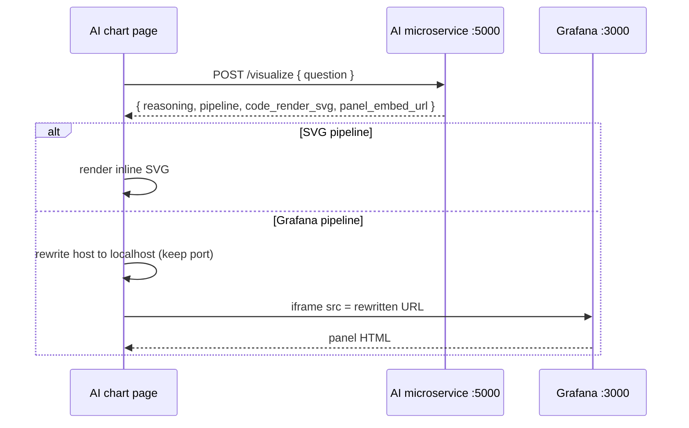

There is also a stub route at `/api/analytics/ai-chart` that predates the microservice integration and returns mocked data based on keyword parsing. The `/analytics/ai-chart` page does **not** call it; it is kept because other code paths may still reference it, and removing it is scheduled as a housekeeping task in Chapter 6.

## 3.10 Configuration governance design

The most complex flow is *snapshot-and-push*, implemented in [src/app/api/config/governance/snapshot-and-push/route.ts](../src/app/api/config/governance/snapshot-and-push/route.ts). Its design follows three principles:

1. **Durable first, live second.** The database transaction (save a new `config_versions` row, deactivate all others, write an `audit_logs` entry) commits before any etcd write begins. If etcd is unavailable, the administrator has a persisted, audited snapshot she can retry against etcd later.
2. **Versioning is derived.** The new version is `{major}.{minor}.{patch+1}` of the latest row; `1.0.0` is used when there is no history. This keeps the domain simple and avoids an explicit version input.
3. **Fan-out to discovered agents.** Rather than maintaining a separate registry of collect agents, the flow *discovers* them from etcd (`/config/collect_agent/` prefix) at the moment of the push. This matches the operational reality that agents can be added and removed at any time.

The full snapshot-and-push sequence is shown below.

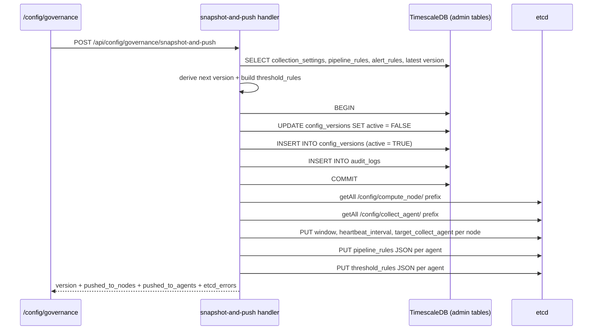

The sibling *rollout* flow (`/api/config/governance/rollout`) is a degenerate case of *snapshot-and-push*: instead of reading current state from the DB it reads a previously saved `config_snapshot`, replays the fan-out to etcd, marks that version active, and writes the audit entry. The symmetric design makes it straightforward to add "preview" and "diff" features later.

## 3.11 Summary

The architecture of the admin application is intentionally thin:

- one Next.js process that serves both HTML and JSON;
- two singletons (`pg.Pool`, `Etcd3`) for every external write;
- two data stores (TimescaleDB, etcd) with well-defined responsibilities;
- two external systems (Grafana, AI microservice) that the browser speaks to directly.

Chapter 4 walks through how each module realises this design in code.

---

# Chapter 4 — Implementation

## 4.0 How to read this chapter

Each module below follows the same three-part structure.

1. **Goal** — one sentence on what the module delivers.
2. **Method and data flow** — how it is built and how a request travels through it, usually with a small diagram.
3. **Decisions and pitfalls** — the trade-offs that required thought and the mistakes a reader should avoid.

The chapter does not contain source listings. Every claim is anchored to a file path in the repository (e.g. [src/app/api/analytics/user-usage/route.ts](../src/app/api/analytics/user-usage/route.ts)); open that file to see the code.

## 4.1 Project bootstrap

### Goal

Produce a runnable Next.js 16 project with TypeScript, Tailwind v4, and the environment variables that every downstream module needs.

### Method

The project was scaffolded with the official Next.js CLI (`npx create-next-app`) selecting TypeScript and the App Router. Four runtime dependencies were added on top of the scaffold: Auth.js v5 (authentication), `pg` (PostgreSQL driver), `etcd3` (etcd client), and Recharts (analytics charts). Tailwind v4 is pulled through `tailwindcss` and `@tailwindcss/postcss` without a JS config file — the theme tokens are declared directly in CSS.

Environment variables are separated by concern, each read by exactly one module:

| Variable | Consumer file | Purpose |
|---|---|---|
| `NEXTAUTH_SECRET` | [src/auth.ts](../src/auth.ts) | JWT signing secret |
| `ADMIN_EMAIL`, `ADMIN_PASSWORD` | [src/auth.ts](../src/auth.ts) | single administrator credentials |
| `TIMESCALE_URL` | [src/lib/db.ts](../src/lib/db.ts) | libpq connection string |
| `ETCD_URL` | [src/lib/etcd.ts](../src/lib/etcd.ts) | `http://host:2379` endpoint |

The deployment layout used for the thesis demo (a single-host topology in which the admin workstation, the application, the monitoring infrastructure, and the HPC cluster each host distinct services) is shown below.

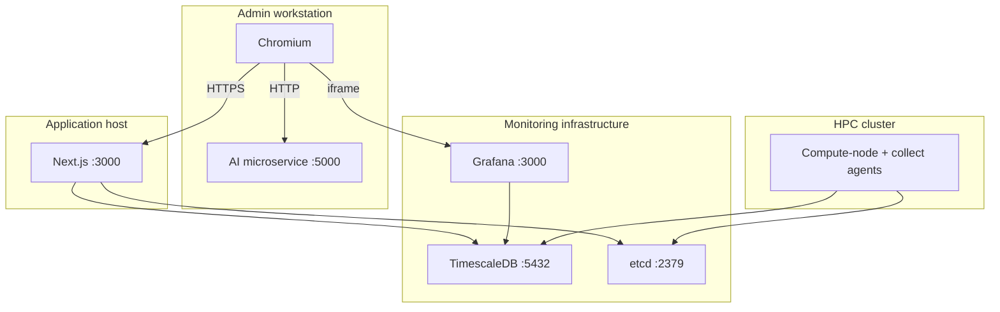

### Decisions

- **No dotenv library.** Next.js 16 loads `.env.local` automatically; adding `dotenv` would duplicate that behaviour.
- **No `tailwind.config.ts`.** Tailwind v4 supports theme declaration directly inside CSS (`@theme { … }` in [src/app/globals.css](../src/app/globals.css)), which keeps the visual identity in a single file.

## 4.2 Authentication and route protection

### Goal

Guarantee that every page can be reached only after a successful login, and that the same gate can be extended to API routes later.

### Method and data flow

Authentication is handled by Auth.js v5 with the Credentials provider, JWT session strategy, and a single user whose identity lives in environment variables. Three pieces cooperate:

1. The **proxy** file [src/proxy.ts](../src/proxy.ts) re-exports Auth.js's `auth` function and declares a URL matcher that intercepts every request except `/login`, `/api/auth/*`, and static assets.
2. The **protected layout** at [src/app/(protected)/layout.tsx](../src/app/(protected)/layout.tsx) is a server component. It calls `auth()` on every request and redirects to `/login` when the session is null.
3. The **login page** at [src/app/(auth)/login/page.tsx](../src/app/(auth)/login/page.tsx) is a client component. It calls `signIn("credentials", …)` and, on success, navigates to `/dashboard`.

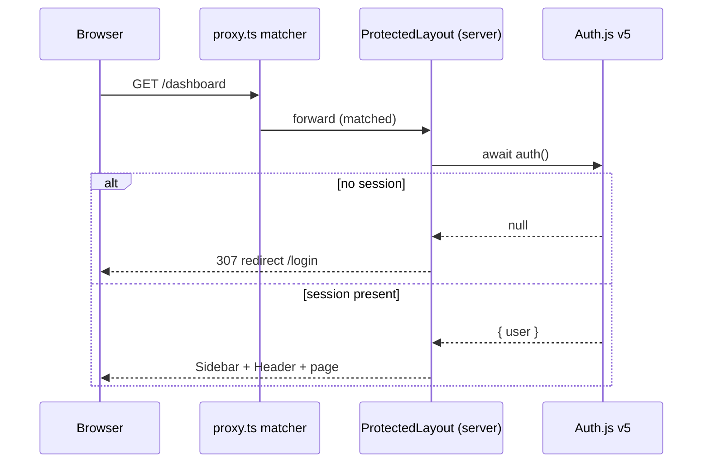

> **[SCREENSHOT: Login page — `/login` showing the credentials form]**

### Decisions and pitfalls

- Next.js 16 renamed *middleware* to *proxy*; a file called `middleware.ts` is silently ignored. The file in this project is therefore `proxy.ts` and it exports `{ auth as proxy }`.
- The proxy matcher currently excludes `/api/auth` but not the rest of `/api/*`. HTML pages are safe, JSON endpoints are not. This is acknowledged in Chapter 6 §6.2 and a fix (calling `auth()` at the top of each handler) is scheduled.
- JWT sessions avoid a server-side session store, which fits the single-process thesis deployment.

## 4.3 Data access layer

### Goal

Give every API route one shared PostgreSQL pool and one shared etcd client, with a pattern that cannot exhaust connections.

### Method

Two singletons are created at module-load time:

- [src/lib/db.ts](../src/lib/db.ts) exports a default `pg.Pool` built from `TIMESCALE_URL`.
- [src/lib/etcd.ts](../src/lib/etcd.ts) exports a default `Etcd3` client built from `ETCD_URL`.

Every API handler that touches PostgreSQL follows the same four-step shape: *acquire → query → release → translate to HTTP*.

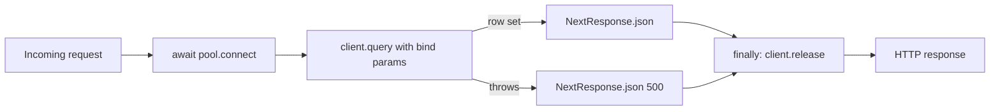

Shared TypeScript types live in [src/types/index.ts](../src/types/index.ts) and are imported by both the server (for query-result typing) and the client (for the shape of fetched JSON).

### Decisions

- **No ORM.** The schema is small and analytics queries lean heavily on TimescaleDB-specific features (`time_bucket`, `DISTINCT ON`), which ORMs abstract awkwardly.
- **`try/catch/finally` pattern.** Release is placed in `finally` so a thrown error still returns the connection to the pool. Forgetting this on a single route would eventually starve the entire application.

## 4.4 Node registry module

### Goal

Maintain the `nodes` table and expose latest metrics per node for the node-list page.

### Method

Four API routes cooperate with two pages:

| File | Role |
|---|---|
| [src/app/api/nodes/route.ts](../src/app/api/nodes/route.ts) | list and create |
| [src/app/api/nodes/[nodeId]/route.ts](../src/app/api/nodes/[nodeId]/route.ts) | read, update, delete by id |
| [src/app/api/nodes/metrics/latest/route.ts](../src/app/api/nodes/metrics/latest/route.ts) | latest hourly bucket per node |
| [src/app/api/nodes/[nodeId]/hourly/route.ts](../src/app/api/nodes/[nodeId]/hourly/route.ts) | time-series for one node |
| [src/app/(protected)/dashboard/nodes/page.tsx](../src/app/(protected)/dashboard/nodes/page.tsx) | node list |
| [src/app/(protected)/dashboard/nodes/[nodeId]/page.tsx](../src/app/(protected)/dashboard/nodes/[nodeId]/page.tsx) | node detail |

### Data-flow sketch for the node list

The node list merges **three** independent data sources: the admin `nodes` table, the live configuration in etcd, and the latest hourly bucket from `node_status_hourly`. Each is fetched in parallel on mount.

```mermaid
flowchart LR
    page[Node list page] -->|fetch| a[/api/nodes]
    page -->|fetch| b[/api/etcd/nodes]
    page -->|fetch| c[/api/nodes/metrics/latest]
    a --> tsdb1[(nodes table)]
    b --> etcd[(etcd)]
    c --> tsdb2[(node_status_hourly)]
    a & b & c --> merge[join by nodeId]
    merge --> render[Render sortable table]
```

> **[SCREENSHOT: Node list — `/dashboard/nodes` sortable table with merged DB + etcd + latest-metrics data]**

> **[SCREENSHOT: Node detail — `/dashboard/nodes/[nodeId]` showing per-node Grafana panels, Recharts time-series, and start/stop button]**

### Decisions and pitfalls

- The "latest bucket" query uses PostgreSQL `DISTINCT ON (node_id)` ordered by `bucket_time DESC`. This is a native, index-friendly way to get one row per node.
- A node can be present in the admin DB but absent from etcd (not provisioned yet) or vice versa. The UI keeps the union of both and marks which side is missing.

## 4.5 Live pipeline configuration (etcd module)

### Goal

Let the administrator see real-time agent configuration, add new nodes and agents to etcd, and turn collection on or off per node.

### Method

The endpoints are grouped by prefix: `/api/etcd/nodes/...` talks to `/config/compute_node/`, and `/api/etcd/agents/...` talks to `/config/collect_agent/`. Each route uses the `etcd3` client's `getAll().prefix(...).strings()` pattern to read a whole subtree as a flat key→value map, then reconstructs structured objects from the flat keys by slicing the prefix and splitting on `/`.

The most interesting handler is the node list, which performs a **fan-in**: it reads two prefixes in parallel (configs and heartbeats), joins them in memory by node id, and derives each node's liveness from heartbeat staleness before returning.

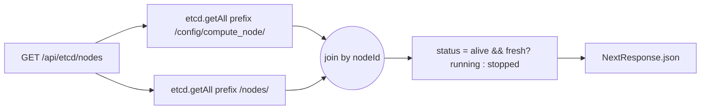

Status derivation uses the rule stated in Chapter 3 §3.6: a node is *running* only when its last heartbeat is recent (within `heartbeat_interval × 3` seconds) and its self-reported status is `alive`. This is implemented inside [src/app/api/etcd/nodes/route.ts](../src/app/api/etcd/nodes/route.ts).

Start/stop is a single PUT on `/config/compute_node/{nodeId}/status`, exposed at [src/app/api/etcd/nodes/[nodeId]/status/route.ts](../src/app/api/etcd/nodes/[nodeId]/status/route.ts).

### Decisions and pitfalls

- etcd values are always strings. JSON-typed fields (`kafka_brokers`, `threshold_rules`, `pipeline_stages`, `process_fields`, `comm_prefixes`) are serialised on every write and parsed on every read; the parsing is wrapped in a `try/catch` so a malformed key never crashes the whole listing.
- Agent and node identifiers are **discovered** from the etcd prefix scan, not maintained in a separate registry. This matches the operational reality that new agents come and go.

## 4.6 Analytics module

### Goal

Answer three classes of questions from TimescaleDB:

- What is the cluster doing right now (last *N* hours)?
- Who is using the cluster, and how much (per user)?
- How did a single user or application behave over time?

### Method

Two API routes cover all three questions:

| File | Role |
|---|---|
| [src/app/api/analytics/cluster-stats/route.ts](../src/app/api/analytics/cluster-stats/route.ts) | cluster-level averages for 1h / 6h / 24h |
| [src/app/api/analytics/user-usage/route.ts](../src/app/api/analytics/user-usage/route.ts) | four modes (`summary`, `timeseries`, `apps`, `app-timeseries`) over `user_app_hourly` |

The `user-usage` handler uses a *mode switch* rather than four separate routes because the inputs (uid list, resource, date range) and the output shape (`rows`) are uniform. The switch is shown below.

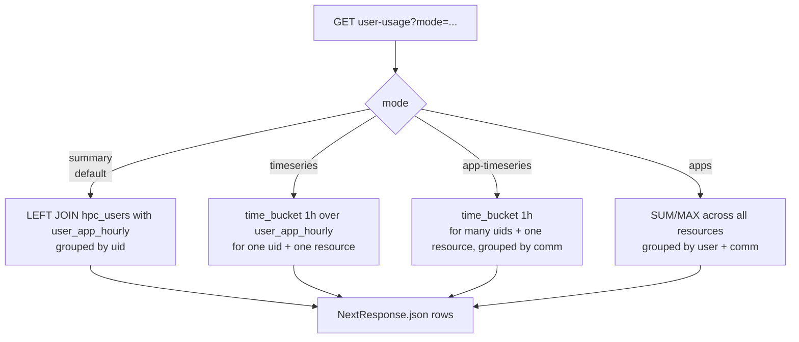

All four modes share the same parameter parsing (dates default to "the last seven days", uid list is parsed and validated), the same bind-parameter discipline, and the same error handling.

> **[SCREENSHOT: Analytics summary — `/analytics` users table sorted by CPU seconds]**

> **[SCREENSHOT: Analytics timeseries — single-user line chart after drilling down on a resource]**

> **[SCREENSHOT: Analytics apps breakdown — per-user per-application table]**

### The SQL-safety method

Because `resource` is a user-controlled string that selects which aggregation expression to run, naive string interpolation would be a classic SQL injection. The method used here is an **allow-list map** declared at module scope: the key is the resource name, the value is a hard-coded SQL fragment (for example `SUM(h.total_cpu_time_seconds)`). When the request arrives, the handler *looks up* the fragment and rejects the request when the key is unknown. No user input ever reaches the SQL text.

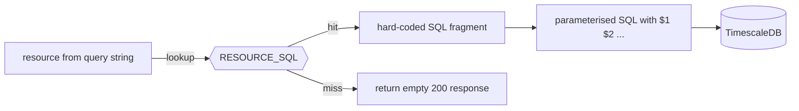

### Decisions and pitfalls

- `time_bucket` is a TimescaleDB extension function; vanilla PostgreSQL will not run this code.
- The `summary` mode performs a `LEFT JOIN` from `hpc_users` so every user shows up even when they produced no records in the date range; without this, idle users would disappear silently from the page.
- The cluster-stats endpoint accepts `range` only from a small whitelist (`1h`, `6h`, `24h`) before the value is cast to a SQL interval.

## 4.7 Real-time monitoring (Grafana embedding)

### Goal

Embed Grafana panels inside the admin UI instead of duplicating Grafana's chart engine.

### Method

A single reusable component — [src/components/dashboard/GrafanaPanel.tsx](../src/components/dashboard/GrafanaPanel.tsx) — wraps an `<iframe>`, shows a loading placeholder until the `onLoad` event fires, and falls back to an explanatory empty state when its `src` prop is empty. Pages compose the iframe URL from three variable pieces:

| Piece | Source |
|---|---|
| `panelId` | hard-coded per metric (CPU, memory, GPU, disk, network) |
| `var-node` | only on node-detail pages; URL-encoded node id |
| `from` / `to` | derived from the time-range selector |

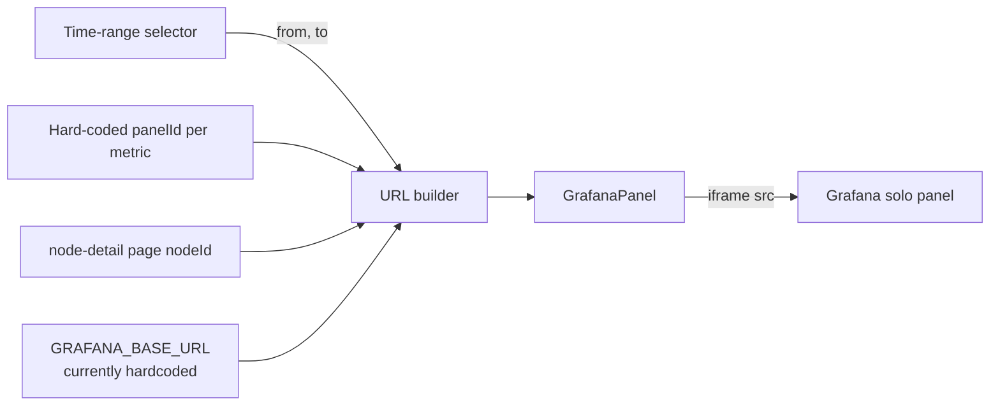

The Grafana side is opted into solo-panel mode with a URL query flag (`__feature.dashboardSceneSolo=true`) so the dashboard chrome is not rendered.

> **[SCREENSHOT: Cluster dashboard — `/dashboard` with node counts, CPU / memory / GPU Grafana panels, and time-range selector]**

### Decisions and pitfalls

- **Why an iframe and not a server-side render?** Grafana owns the rendering and already knows the TimescaleDB schema. Re-implementing the same panels in the admin app would create a second source of truth.
- **Cross-origin silent failures.** Iframes do not raise CORS errors when blocked; they just appear empty. If the admin's browser cannot reach Grafana (VPN, IP allow-list), the user sees a blank panel with no error. The placeholder in `GrafanaPanel` addresses the "no URL configured" case but cannot see a reachability problem.
- **Hardcoded base URL.** Several pages interpolate the Grafana host literally. Extracting this into a single URL builder is listed in Chapter 6 §6.3.

## 4.8 Configuration management module

This is the most involved module, so it is split into three sub-areas: collection settings, rules (pipeline + alerts), and governance.

### 4.8.1 Collection settings

**Goal.** Let the administrator edit per-node collection intervals, windows, and the collect-agent assignment, while keeping the DB and etcd in sync.

**Method.** The list endpoint performs a `LEFT JOIN` of `nodes` and `collection_settings`, so nodes without a custom setting still appear with their defaults. The PUT endpoint at [src/app/api/config/collection/[nodeId]/route.ts](../src/app/api/config/collection/[nodeId]/route.ts) performs an **UPSERT** in the DB first and then *mirrors* the three relevant fields (`window`, `heartbeat_interval`, `target_collect_agent`) to etcd.

The mirror is deliberately **non-fatal**: a failure on the etcd side does not roll back the DB write. The UI surfaces any etcd error so the administrator knows the keys are out of sync.

> **[SCREENSHOT: Collection settings — `/config/collection` per-node interval, window, and collect-agent editor]**

### 4.8.2 Pipeline and alert rules

**Goal.** Maintain the DB-backed catalogue of rules, then fan the enabled subset out to every discovered collect agent.

**Method.** Both rule types have the same CRUD shape in the database: list, insert, update, delete. The fan-out is triggered by a dedicated action endpoint:

- `POST /api/config/pipeline/push-to-etcd` writes all *enabled* pipeline rules as a JSON array under `/config/collect_agent/{agentId}/pipeline_rules` for every discovered agent. See [src/app/api/config/pipeline/push-to-etcd/route.ts](../src/app/api/config/pipeline/push-to-etcd/route.ts). The target schema expected by the collect agent is actually three separate keys (`pipeline_stages`, `process_fields`, `comm_prefixes`); aligning the push handler with that schema is tracked in Chapter 6 §6.3.
- `POST /api/config/alerts/push-to-etcd` folds upper-bound alert rules (operators `>` and `>=`) into a single `threshold_rules` object keyed by the etcd-side name (`cpu_usage_percent`, `memory_usage_percent`, `gpu_utilization_percent`, `disk_usage_percent`) and writes that object under `/config/collect_agent/{agentId}/threshold_rules`. See [src/app/api/config/alerts/push-to-etcd/route.ts](../src/app/api/config/alerts/push-to-etcd/route.ts).

Two mapping rules matter:

1. **Resource name mapping.** The DB values (`cpu`, `mem`, `gpu`, `disk`, `net`) are mapped to the etcd keys through a constant dictionary. `net` has no etcd counterpart and is deliberately skipped — those rules remain in-app alerts only.
2. **"Most restrictive wins".** If two alerts target the same resource, the lower threshold prevails. The UI documents this in a tooltip.

The fold-and-fan-out shape is shown below.

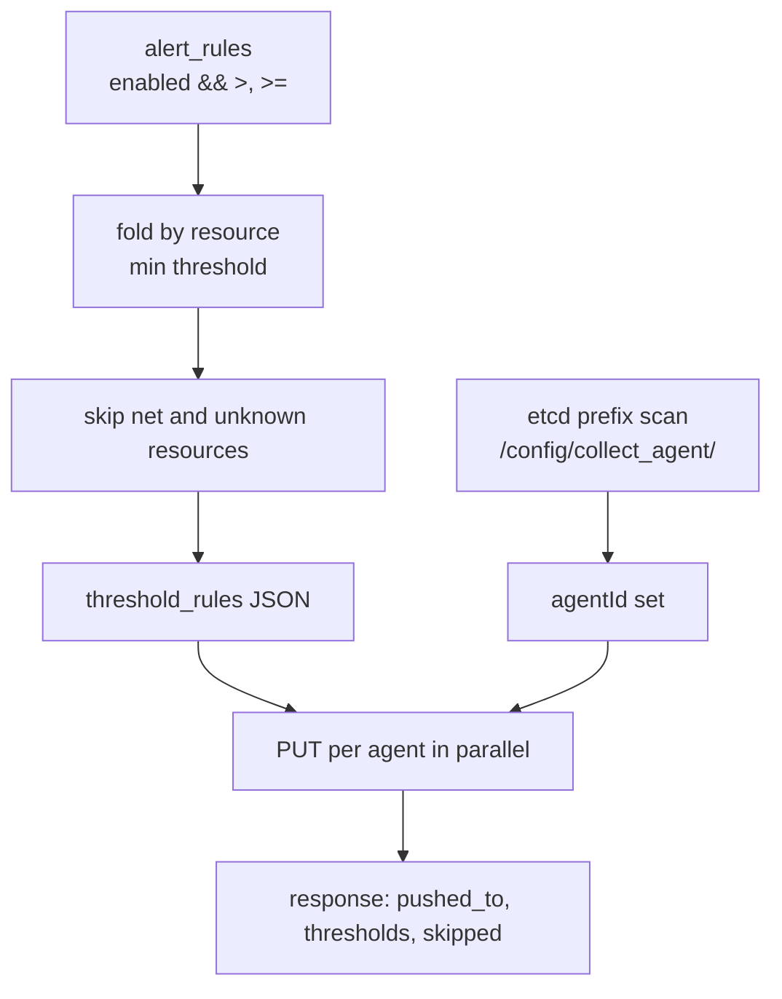

The sequence for the push-alerts-to-etcd flow is shown below.

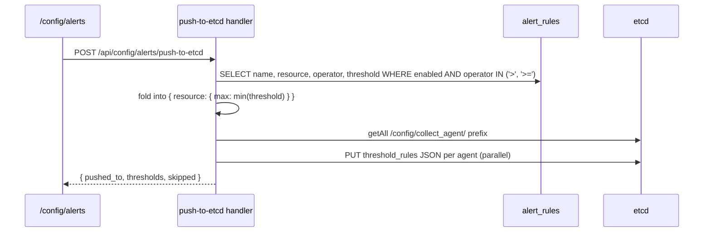

> **[SCREENSHOT: Pipeline rules — `/config/pipeline` rule list with "Push to etcd" button]**

> **[SCREENSHOT: Alert rules — `/config/alerts` rule list with "Push to etcd" button]**

**Decisions and pitfalls.**

- **Semantic status codes.** The alert-push handler returns `422 Unprocessable Entity` when there are no syncable rules and `404` when there are no agents. Neither is a server error, so a `500` would mislead the UI.
- **Parallel fan-out.** Writes to different agents are independent; they are issued with `Promise.all` rather than sequentially.

### 4.8.3 Governance (snapshot-and-push, rollout, versions, audit)

**Goal.** Make every configuration change reversible and accountable by versioning the full state and recording who did what.

**Method — snapshot-and-push.** The flow combines a DB-first transaction with a best-effort etcd fan-out. It lives in [src/app/api/config/governance/snapshot-and-push/route.ts](../src/app/api/config/governance/snapshot-and-push/route.ts). The stages are:

1. Read the current state from the database: collection settings (joined with `nodes`), enabled pipeline rules, upper-bound alert rules, and the latest version string.
2. Derive the next semantic version by bumping the patch digit of the latest one (or `1.0.0` when there is no history).
3. In a single DB transaction, deactivate all existing versions, insert the new row marked active, and write a single `audit_logs` entry of action `ROLLOUT`. Commit.
4. Discover every node and every agent from the etcd prefixes.
5. Fan out in parallel: per-node writes for collection settings; per-agent writes for the pipeline-rules JSON and the threshold-rules JSON.
6. Report back with the saved version, the list of nodes and agents that received keys, and any etcd errors.

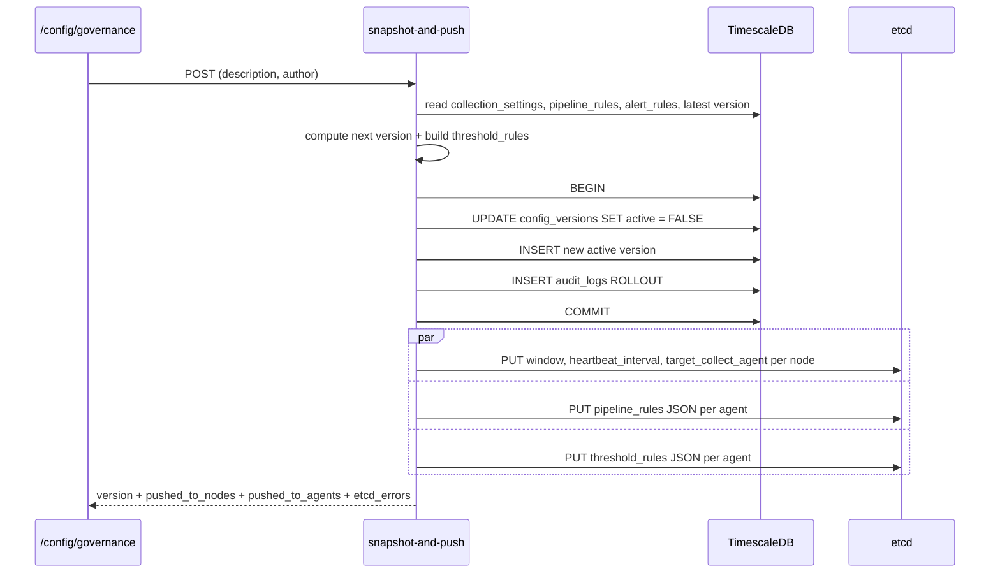

**Method — rollout.** Rollout is the symmetric case: instead of reading current state from the DB it reads a previously saved `config_snapshot`, replays the fan-out to etcd, marks that version active, and writes a new audit entry. The implementation lives in [src/app/api/config/governance/rollout/route.ts](../src/app/api/config/governance/rollout/route.ts).

> **[SCREENSHOT: Governance — `/config/governance` showing version history and audit log]**

**Decisions and pitfalls.**

- **Durable first, live second.** The DB transaction commits before any etcd write starts. If etcd is unreachable, the snapshot is still recorded and the administrator can retry the push. The alternative (write-through etcd, then DB) would lose the audit trail on partial failure.
- **Discovery, not registry.** Agents and nodes are discovered from etcd at the moment of the push; no separate list must be maintained.
- **Version derivation.** `nextVersion()` is trivial — `1.0.0` when there is no history, otherwise `{major}.{minor}.{patch+1}`. Keeping this simple avoids exposing a version-input UI.

## 4.9 Notifications

### Goal

Show alert instances to the administrator and let each one be acknowledged.

### Method

The database holds `notifications` rows; the list endpoint joins with `nodes` to produce a human-readable `node_name`. A side panel component ([src/components/layout/NotificationsPanel.tsx](../src/components/layout/NotificationsPanel.tsx)) renders the list, and a PUT on `/api/notifications/[id]` sets `acknowledged = TRUE`.

> **[SCREENSHOT: Notifications panel — slide-out panel invoked from the header, listing unacknowledged alerts]**

### Decisions and pitfalls

- There is no de-duplication today. If two agents produce identical alerts, both rows will appear. Adding an `origin` column or a uniqueness constraint is straightforward and left for future work.

## 4.10 AI chart generator integration

### Goal

Turn an English question from the administrator into a rendered chart inside the same page.

### Method

The page [src/app/(protected)/analytics/ai-chart/page.tsx](../src/app/(protected)/analytics/ai-chart/page.tsx) sends the typed question directly to the external microservice at `http://localhost:5000/visualize`. The microservice replies with either an SVG string or a Grafana embed URL (or both). The page branches on the response:

- When an SVG is present, it is rendered inline by injecting the markup into a `div`.
- When a Grafana URL is present, it is embedded through the reusable `GrafanaPanel` component.

The Grafana URL coming back from the microservice may point to an internal host that is unreachable from the admin's browser (for instance, a container name such as `grafana` that resolves only inside a Docker network). To make the iframe work, the page **rewrites** the host portion of the URL to `localhost` while preserving the original port.

```mermaid
sequenceDiagram
    participant Page as /analytics/ai-chart
    participant AI as AI microservice :5000
    participant Grafana

    Page->>AI: POST /visualize { question }
    AI-->>Page: { reasoning, pipeline, code_render_svg, panel_embed_url }
    alt SVG pipeline
        Page->>Page: render inline SVG
    else Grafana pipeline
        Page->>Page: rewrite host -> localhost, keep port
        Page->>Grafana: iframe src = rewritten URL
        Grafana-->>Page: panel HTML
    end
```

> **[SCREENSHOT: AI Chart Generator — `/analytics/ai-chart` with prompt and returned Grafana panel embed]**

### Decisions and pitfalls

- **Why call the microservice from the browser?** The thesis deployment runs everything on one workstation, so direct browser-to-microservice HTTP is simpler. In production the same call should be proxied through a Next.js API route to keep `localhost:5000` out of the client bundle.
- **Dead stub.** The in-repo handler `/api/analytics/ai-chart` pre-dates the microservice and is not called from the current page. Its removal is scheduled in Chapter 6 §6.3.

## 4.11 Chat module (admin assistant)

### Goal

Offer a skeleton chat interface that can be wired to the same AI microservice later.

### Method

The page at [src/app/(protected)/chat/page.tsx](../src/app/(protected)/chat/page.tsx) sends conversation history to the handler at [src/app/api/chat/route.ts](../src/app/api/chat/route.ts). The handler currently returns canned replies based on keyword matching.

> **[SCREENSHOT: Chat page — `/chat` stub interface]**

### Decisions and pitfalls

- The page and the handler disagree on the request body: the page sends a `messages` array, the handler reads a single `message`. This is a known bug, documented in Chapter 6 §6.2, and is not on the critical demo path.

## 4.12 Styling and UX system

### Goal

Provide a consistent dark theme with minimal configuration.

### Method

Tailwind v4 is loaded by a single `@import "tailwindcss"` line in [src/app/globals.css](../src/app/globals.css). A `@theme { … }` block in the same file declares the palette tokens used across the UI (background, surface, card, border, primary). Reusable primitives (Button, Input, Select, Modal, Badge, DateRangePicker, Table) live in [src/components/ui](../src/components/ui); every page composes these rather than writing bespoke markup.

| Token | Hex | Used for |
|---|---|---|
| `--color-bg` | `#0d1117` | page background |
| `--color-surface` | `#161b22` | section surface |
| `--color-card` | `#1c2128` | card container |
| `--color-border` | `#30363d` | all borders |
| `--color-primary` | `#58a6ff` | interactive elements |

### Decisions and pitfalls

- Theme-in-CSS is a v4-only feature; Tailwind v3 plugins that expect `tailwind.config.ts` must be configured inline.

## 4.13 Cross-cutting concerns

### Error handling

Every API handler follows the same skeleton: acquire resources, perform the work, return a JSON response, release resources in `finally`. Error translation is uniform:

| Situation | HTTP status |
|---|---|
| Successful read | 200 |
| Successful create | 201 |
| Request payload invalid | 400 |
| Target not found | 404 |
| Semantic rejection (e.g. no rules to push) | 422 |
| Unexpected failure on our side | 500 |
| Dependency unavailable (etcd unreachable) | 503 |

### Loading and empty states

Each page renders three distinct states:

1. a skeleton or `Loading…` message while the initial fetch is in flight;
2. an empty-state panel with a call-to-action when the list is empty;
3. an inline error banner when the API returns a non-2xx status.

### Shared types

[src/types/index.ts](../src/types/index.ts) centralises the TypeScript shapes used both on the server (for query results) and in the client (for fetched JSON). When the schema evolves, one file changes.

### Logging

Server-side `console.error` is used for unexpected API failures. Structured logging with pino and an OpenTelemetry exporter is listed in Chapter 6 §6.3.

## 4.14 Summary

The implementation is narrow by design. Four layers, two external clients, one iframe pattern, one outbound HTTP call. Every module follows the same shape — *page → fetch → API handler → pool or etcd* — which keeps the cognitive overhead low and makes the proposed testing plan in Chapter 5 directly applicable.

---

# Chapter 5 — Testing

> As of the submission of this chapter, no automated tests are implemented yet; this chapter describes the test architecture and concrete suites that will be added before the defence. Where results will be filled in later, a placeholder table is provided.

## 5.1 Testing strategy

The application is small (≈30 API handlers, ≈15 pages, two singletons) and integrates with three external dependencies (TimescaleDB, etcd, Grafana) plus one HTTP microservice (the AI endpoint). A classic test pyramid is therefore both tractable and meaningful:

```
             ┌──────────────────────────┐
             │   Manual exploratory     │
             ├──────────────────────────┤
             │  End-to-end (Playwright) │
             ├──────────────────────────┤
             │  API / integration       │
             ├──────────────────────────┤
             │  Unit (Vitest + RTL)     │
             └──────────────────────────┘
```

Principles:

1. **Every functional requirement in §2.3 must be covered by at least one automated test and one manual test case.**
2. **Integration over mocking.** The API tier is tested against a real TimescaleDB and a real etcd container so that SQL bugs and etcd3 client mismatches surface early.
3. **External services are stubbed, not called.** The Grafana iframe and the AI microservice are replaced by local HTTP stubs in the e2e tier.
4. **Test data is deterministic.** A single SQL seed file produces reproducible `node_status_hourly` and `user_app_hourly` buckets for assertion.

## 5.2 Unit tests

### Scope

Unit tests cover pure functions and presentational components. The aim is speed (tens of milliseconds per test) so they can run on every commit.

### Tooling

- **Vitest** (faster than Jest, first-class TypeScript, works with Vite's module resolver).
- **@testing-library/react** for component rendering.
- **@testing-library/jest-dom** for custom matchers.

### Candidate targets

| Unit | Test |
|---|---|
| `parseNodes` / `parseHeartbeats` in [src/app/api/etcd/nodes/route.ts](../src/app/api/etcd/nodes/route.ts) | flatten etcd KV map, ignore malformed entries |
| `nextVersion` in [src/app/api/config/governance/snapshot-and-push/route.ts](../src/app/api/config/governance/snapshot-and-push/route.ts) | `undefined` → `1.0.0`, invalid → `1.0.0`, `1.2.3` → `1.2.4` |
| heartbeat staleness logic (extract to a helper) | alive within threshold, stale outside, missing heartbeat = stopped |
| `RESOURCE_TO_ETCD_KEY` mapping (alerts push) | known resources map, unknown skipped |
| URL host-rewrite in [src/app/(protected)/analytics/ai-chart/page.tsx](../src/app/(protected)/analytics/ai-chart/page.tsx) | remote URL with port preserved; URL without port defaults to no port; null remains null |
| `GrafanaPanel` component | loading placeholder then iframe after `onLoad`; empty placeholder when `src` not set |
| `NodeStatusBadge` | colours match `running`, `stopped`, `degraded` |

### Target metric

≥ 80 % line coverage on pure helpers. Coverage of full React pages is not a goal at this tier — they are covered by e2e.

## 5.3 API / integration tests

### Scope

Each API handler is called end-to-end against a spun-up Next.js server, with real TimescaleDB and real etcd running in Docker. The goal is to catch SQL errors, schema drift, and etcd key-format mistakes.

### Tooling

- **Vitest** as the runner.
- **Docker Compose** test fixture: TimescaleDB image, etcd image, optional Grafana stub.
- **supertest** (or `fetch` against a bound port) for HTTP.
- Seed SQL applied before each suite (transactional teardown where possible, `TRUNCATE` between suites otherwise).

### Coverage matrix (one row per API route)

| Group | Endpoint | Positive | Negative |
|---|---|---|---|
| nodes | `GET /api/nodes` | returns seeded rows sorted by name | empty table returns `[]` |
| nodes | `POST /api/nodes` | inserts and returns `201` | duplicate id returns `500` (documented pitfall) |
| nodes | `GET /api/nodes/[id]/hourly?range=24h` | returns 24 buckets per node | invalid range falls back to `24h` |
| etcd | `GET /api/etcd/nodes` | includes derived `running`/`stopped` | etcd unreachable returns `503` |
| etcd | `POST /api/etcd/nodes` | creates four keys under the prefix | missing `nodeId` returns `400` |
| etcd | `PUT /api/etcd/nodes/[id]/status` | flips `status` key | unknown node still writes (documented behaviour) |
| analytics | `GET /api/analytics/cluster-stats?range=6h` | returns 6-hour aggregates | invalid range falls back to `1h` |
| analytics | `GET /api/analytics/user-usage?mode=summary` | all users appear (LEFT JOIN) | empty range returns rows with `NULL` totals |
| analytics | `mode=timeseries&uid=...&resource=cpu` | hourly rows | invalid `resource` returns `[]` |
| config/collection | `PUT /api/config/collection/[id]` | UPSERT in DB + three etcd writes | etcd failure does not fail DB write |
| config/pipeline | `POST /api/config/pipeline/push-to-etcd` | enabled rules land on every agent | no agents returns `404` |
| config/alerts | `POST /api/config/alerts/push-to-etcd` | most-restrictive wins; skipped list populated for `net` | no syncable rules returns `422` |
| config/governance | `POST /api/config/governance/snapshot-and-push` | new version active; others deactivated; audit entry; etcd keys written | etcd down: `etcd_errors` populated, DB still committed |
| config/governance | `POST /api/config/governance/rollout` | selected version active; snapshot replayed | unknown version returns `404` |
| notifications | `PUT /api/notifications/[id]` | `acknowledged = true` | unknown id returns `404` |

### Representative test (pseudocode)

```ts
import { describe, it, beforeAll, expect } from "vitest"
import { setupDb, teardownDb } from "./fixtures/db"
import { setupEtcd, teardownEtcd, etcdClient } from "./fixtures/etcd"

describe("POST /api/config/alerts/push-to-etcd", () => {
  beforeAll(async () => {
    await setupDb()  // seeds alert_rules + discovers 2 agents
    await setupEtcd()
  })

  it("writes the most-restrictive threshold to every agent", async () => {
    const res = await fetch("http://localhost:3000/api/config/alerts/push-to-etcd", { method: "POST" })
    expect(res.status).toBe(200)
    const body = await res.json()
    expect(body.pushed_to.sort()).toEqual(["agent_a", "agent_b"])

    const kvA = await etcdClient.get("/config/collect_agent/agent_a/threshold_rules").string()
    expect(JSON.parse(kvA!)).toMatchObject({
      cpu_usage_percent: { max: 75 },   // min of 75 and 90
    })
  })
})
```

## 5.4 End-to-end UI tests

### Scope

Each use case from §2.5 has an end-to-end scenario that clicks through the real UI. The goal is to catch integration bugs across the page + API + DB layers.

### Tooling

- **Playwright** (Chromium, Firefox, WebKit for cross-browser where it matters).
- Fixtures: the same Docker Compose bundle as the API tier, plus a stub Grafana server and a stub AI server (simple Node HTTP servers returning canned responses keyed by query string).

### Scenario list (one per use case)

| UC | Scenario |
|---|---|
| UC-01 | Log in with valid credentials → land on `/dashboard`. Log in with invalid → stay on `/login` with an error. |
| UC-02 | Dashboard shows node counts matching seeded data; time-range selector changes `from`/`to` on every Grafana iframe `src`. |
| UC-03 | Clicking a node row opens `/dashboard/nodes/[id]`; start/stop button flips `status` key in etcd (asserted through the API). |
| UC-04 | Toggling collection updates the UI indicator; Grafana panels reload with `var-node=...`. |
| UC-05 | Analytics page with date range produces summary; selecting a user shows time-series. |
| UC-06 | AI chart page: type question → stub AI server returns a prepared SVG → chart is rendered. |
| UC-07 | Create node form → row appears in list; delete → row disappears. |
| UC-08 | Create pipeline rule → click "push to etcd" → stub etcd recorded the JSON array. |
| UC-09 | Create alert → push → etcd recorded threshold JSON. |
| UC-10 | Governance snapshot → version list increases; etcd keys refreshed. |
| UC-11 | Rollout → selected version becomes active; new audit entry. |
| UC-12 | Audit log lists actions chronologically. |
| UC-13 | Acknowledge notification → disappears from unacknowledged list. |

## 5.5 Manual / exploratory tests

For features that are too dynamic or visual to automate meaningfully (Grafana iframes, AI chart rendering), a manual test plan complements the automated tiers.

### Template (to reproduce per case)

| Field | Value |
|---|---|
| ID | MT-XX |
| Use case | UC-XX |
| Preconditions | e.g. "at least one registered node and one running agent" |
| Steps | numbered list |
| Expected result | single paragraph |
| Actual result | to fill |
| Pass / fail | to fill |
| Notes | screenshots, logs |

### Proposed case list (25–30 cases)

The manual suite duplicates UC-01 … UC-13 and adds variants for:

- Cross-browser rendering of the dashboard (Chrome, Firefox, Safari).
- Behaviour when etcd is unreachable (banner appears, other pages still usable).
- Behaviour when the AI microservice is unreachable (inline error, form stays usable).
- Behaviour when TimescaleDB is slow (loading placeholders visible; no UI freeze).

## 5.6 Non-functional tests

### Performance

- Tool: **k6** (JavaScript DSL, easy to plug in CI).
- Targets: the three analytics endpoints (`cluster-stats`, `user-usage?mode=summary`, `nodes/metrics/latest`) against a seeded year of hourly buckets.
- Pass criterion: p95 < 500 ms at 10 RPS; no errors at 50 RPS.

### Security

- **Dependency audit:** `npm audit --production` must report zero high severity.
- **Authentication bypass:** manual attempt to call every `/api/*` route without a session cookie. Currently expected to succeed (known gap); after the Chapter 6 fix, every call must return `401`.
- **SQL injection:** send crafted `resource=`, `uid=`, `range=` values to the analytics endpoints. Expected: allow-list mismatches return `[]` or `400`, never an SQL error.
- **Iframe sandboxing:** verify that the Grafana iframe `sandbox` attribute (added as part of future hardening) does not break authenticated dashboards.

### Reliability

- With etcd down, `/dashboard` must render with a visible warning but no JavaScript error.
- With the AI microservice down, `/analytics/ai-chart` must display an inline error without unmounting the page.

> **[SCREENSHOT: Error state — etcd unreachable on `/dashboard` with warning banner]**

> **[SCREENSHOT: Error state — AI microservice unreachable on `/analytics/ai-chart` with inline error]**

## 5.7 Test environment and data

### Docker Compose bundle

```yaml
# tests/docker-compose.yml (proposed)
services:
  timescale:
    image: timescale/timescaledb:latest-pg16
    environment:
      POSTGRES_PASSWORD: admin123
      POSTGRES_DB: hpc_monitoring_test
    ports: ["5433:5432"]
  etcd:
    image: quay.io/coreos/etcd:latest
    command: >
      etcd --name s1
           --listen-client-urls http://0.0.0.0:2379
           --advertise-client-urls http://etcd:2379
    ports: ["2380:2379"]
  grafana-stub:
    build: ./stubs/grafana
    ports: ["3001:3000"]
  ai-stub:
    build: ./stubs/ai
    ports: ["5001:5000"]
```

### Seed SQL

A single file `tests/fixtures/seed.sql` applies:

- two `nodes` rows (`node_a`, `node_b`) with two different `collect_agent` values;
- five `hpc_users` rows;
- 30 days of `node_status_hourly` buckets for each node with a known sine wave for CPU and constant values for memory/GPU;
- 30 days of `user_app_hourly` rows, with one user heavy on GPU, one on CPU, one idle.

Seeding is deterministic (no `now()`, explicit `bucket_time`) so assertions like *"CPU average for the last 24 hours is 52.3 ± 0.1"* are stable.

## 5.8 Results template

The table below is left with placeholders. Fill in after the suites are executed; a screenshot of the CI dashboard will replace the placeholder columns in the final thesis.

| Tier | Tool | Test count | Passed | Failed | Coverage |
|---|---|---|---|---|---|
| Unit | Vitest + RTL | _TBD_ | _TBD_ | _TBD_ | _TBD_ |
| Integration | Vitest + supertest | _TBD_ | _TBD_ | _TBD_ | — |
| E2E | Playwright | _TBD_ | _TBD_ | _TBD_ | — |
| Manual | — | ~30 | _TBD_ | _TBD_ | — |
| Performance | k6 | 3 scenarios | _TBD_ | _TBD_ | — |

### Known gaps carried into Chapter 6

- The admin application runs as a single Next.js process; there is no load-balancer test.
- Authentication is a single-user credentials provider; there is no OIDC flow to test end to end.
- Browser compatibility with Safari 17+ and Firefox 128+ is manually verified only.

---

# Chapter 6 — Conclusion and Future Work

## 6.1 Summary of contributions

This thesis delivers `hpc-admin`, a single-page Next.js 16 web application that gives HPC administrators a unified console over an existing monitoring pipeline. The four product goals stated in §1.3 map directly to the modules in Chapter 4:

| Goal | Delivered through |
|---|---|
| Real-time resource monitoring | Grafana solo-panel iframes on `/dashboard` and `/dashboard/nodes/[nodeId]` (§4.7), composed from a hard-coded URL template and time-range selector. |
| Historical usage tracking | TimescaleDB queries against `node_status_hourly` and `user_app_hourly` exposed through `/api/analytics/*` and `/api/nodes/*`, consumed by `/analytics` and the node detail page via Recharts (§4.4, §4.6). |
| AI-assisted charting | Integration with a separate AI microservice at `http://localhost:5000/visualize`, with on-the-fly host rewriting of returned Grafana URLs (§4.10). |
| Dynamic pipeline configuration | CRUD on DB-backed `pipeline_rules`, `alert_rules`, and `collection_settings`, plus push-to-etcd fan-out and a governance layer (snapshot, version, audit, rollout) in §4.8. |

Architecturally, the application stays deliberately thin: a single Next.js process, two singletons (`pg.Pool`, `Etcd3`), two data stores with well-defined responsibilities, two external systems the browser speaks to directly. Every module follows the same *page → fetch → route handler → pool/etcd* shape, which should make the codebase easy for a second developer to pick up.

## 6.2 Limitations

It is important to acknowledge the gaps that remain. Each one has a corresponding item in §6.3.

1. **Single admin account.** Authentication uses a credentials provider whose only user lives in environment variables ([src/auth.ts](../src/auth.ts)). There is no role-based access control, no SSO, no account self-service.
2. **API routes are not protected by the proxy matcher.** The current matcher in [src/proxy.ts](../src/proxy.ts) excludes `/api/auth` but also leaves every other `/api/*` route unguarded. HTML pages are safe; JSON endpoints are not.
3. **AI chart and chat contracts are inconsistent.**
   - The AI chart page calls the external microservice directly and does **not** use the in-repo `/api/analytics/ai-chart` stub — the stub is dead code.
   - The chat page sends `{ messages: [...] }` while `/api/chat` reads `{ message }`, so the stub cannot see the latest user message.
4. **Custom dashboards are still mocked.** `/analytics/custom` reads from [src/lib/mockData/analytics.ts](../src/lib/mockData/analytics.ts) even though a `custom_dashboards` table exists in the DB schema. There is no persistence, so saved panels do not survive reloads.
5. **Grafana URLs are hardcoded in several pages.** Dashboard and node detail pages assemble iframe URLs from literal strings such as `http://10.1.8.155:3000/d-solo/adtfbh4/h6-monitoring?…`. Moving a cluster to a new host requires editing multiple files. `GrafanaPanel` even references an env var `GRAFANA_BASE_URL` in its placeholder text that is not actually read anywhere.
6. **Schema drift between the admin app and the collect agent.** The collect agent reads three distinct keys — `pipeline_stages`, `process_fields`, `comm_prefixes` — while the admin application still writes a single legacy `pipeline_rules` array. `threshold_rules` is consumed by both sides but the admin code uses the older JSON key `gpu_max_utilization_percent` whereas the agent expects `gpu_utilization_percent`. As a result, pushing configuration through the web UI does not fully reach the agent today.
7. **Observability is minimal.** Server-side `console.error` only. There are no metrics, no traces, no structured logs.
8. **No automated tests yet.** Chapter 5 proposes a full pyramid but execution is pending. The risk of regression on any refactor is therefore high.
9. **Known bug in `POST /api/nodes`.** Inserting a duplicate primary key returns a generic `500` instead of `409 Conflict`; the error payload does not describe the cause. Low priority but worth noting.

## 6.3 Future work

Grouped by effort and risk.

### Short term (1–2 weeks)

- **Protect `/api/*` by default.** Add a small wrapper that calls `await auth()` at the top of each handler and returns `401` when no session exists; alternatively extend the proxy matcher to cover `/api/*` with an exception list. Once protected, run the Chapter 5 security tests.
- **Extract `GRAFANA_BASE_URL`.** Read the value from `process.env.GRAFANA_BASE_URL` in a single `src/lib/grafana.ts` helper; every page composes URLs through `buildSoloPanelUrl({ panelId, nodeId, from, to })`. Removes hardcoded IPs.
- **Harmonise the chat contract.** Pick one shape (`{ messages: [...] }`) and fix the stub to read the latest entry.
- **Delete the `/api/analytics/ai-chart` stub** or rewire it to call the real microservice server-side so the browser does not need direct access to `http://localhost:5000`.
- **Align the pipeline push with the agent schema.** Replace the single `pipeline_rules` array write with three separate writes to `pipeline_stages`, `process_fields`, and `comm_prefixes`, matching the keys the collect agent actually reads (documented in Appendix B). This also requires a small schema change in the admin DB so the three arrays can be edited independently. Fix the threshold-rules JSON key for GPU (`gpu_max_utilization_percent` → `gpu_utilization_percent`) at the same time.
- **Wire real `custom_dashboards` CRUD.** Replace the mock imports on `/analytics/custom` with `fetch('/api/analytics/custom-dashboards')`.
- **Return `409` on duplicate node inserts** with a helpful error body.

### Medium term (1–2 months)

- **Role-based access control.** Introduce `users` and `user_roles` tables; switch from credentials to Auth.js OIDC with an identity provider. Expose roles as JWT claims and add `requireRole()` helpers.
- **JSON schema validation on every write.** Each `POST`/`PUT` handler validates its body with Zod before touching the DB or etcd. Returns a structured `400` with field-level errors.
- **Structured logging with pino + OpenTelemetry.** A shared `src/lib/logger.ts` emits JSON logs; a wrapper emits spans around DB and etcd calls.
- **Automated test execution in CI.** GitHub Actions (or similar) runs the Chapter 5 suites on every push; Docker Compose fixtures run as services.
- **Rate limiting and CSRF protection on state-changing API routes.** `upstash/ratelimit` or `iron-session` + standard CSRF tokens on form posts.

### Long term (research-flavoured)

- **Replace the AI chart stub with a first-class planner.** The microservice currently returns either SVG or a Grafana URL. A more ambitious design would return a structured chart specification (Vega-Lite) that the admin app renders natively, so every AI-generated chart becomes savable as a custom dashboard.
- **Real-time push instead of poll.** The dashboard currently refreshes iframes and polls API endpoints on an interval. WebSocket (or Server-Sent Events) feeds from the collect agent would let the UI update the instant metrics arrive.
- **Multi-cluster support.** Today the application assumes a single HPC cluster (one Grafana, one etcd, one TimescaleDB). Extending the schema to include a `cluster_id` everywhere — and letting the admin switch between clusters at the top of the UI — would make the application useful to multi-site operators.

## 6.4 Reflection

Building the application was as much about deciding what *not* to add as it was about writing code. Three decisions mattered most:

1. **Do not reimplement Grafana.** Grafana already renders beautiful real-time charts; embedding solo panels behind a single URL builder removes an entire category of work.
2. **Do not hide the existing pipeline's data model behind an ORM.** TimescaleDB hypertables and etcd keys have opinionated schemas; `pg` and `etcd3` let the application talk to them directly, keep queries readable, and move faster.
3. **Commit durable state before live state.** The governance module writes to the database transactionally, then fans out to etcd on a best-effort basis. If etcd is down, the admin still has a versioned, audited snapshot she can push later.

Technically, the project was the author's first encounter with Next.js 16 (the renamed proxy file), Tailwind CSS v4 (theme-in-CSS rather than `tailwind.config.ts`), and Auth.js v5 (`auth()` instead of `getServerSession()`); each of the three frameworks had breaking changes relative to the majority of tutorials still online. Recording those pitfalls in Chapter 4 was a deliberate effort to save the next developer the same debugging.

The work has revealed that, at the admin-console level, the *hardest* problems are neither performance nor scale — the dataset is bounded by cluster size — but **trust and auditability**: when an administrator presses *push to etcd*, she must believe the system did what it said. The governance layer in §4.8 is the author's attempt to answer that need; making it richer (preview, diff, dry-run) is the most interesting direction for future work.

---

# Appendix A — API Endpoint Catalogue

Every route handler under [src/app/api](../src/app/api) as of the submission of this report.

## Authentication

| Method | Path | Source | Purpose |
|---|---|---|---|
| `GET`, `POST` | `/api/auth/[...nextauth]` | [route.ts](../src/app/api/auth/[...nextauth]/route.ts) | Auth.js v5 handlers. |

## Nodes (TimescaleDB-backed registry)

| Method | Path | Source | Purpose |
|---|---|---|---|
| `GET` | `/api/nodes` | [route.ts](../src/app/api/nodes/route.ts) | List nodes ordered by name. |
| `POST` | `/api/nodes` | same | Insert `{id, name, ip, group_name, collect_agent}`. |
| `GET` | `/api/nodes/[nodeId]` | [route.ts](../src/app/api/nodes/[nodeId]/route.ts) | Single node by id. |
| `PUT` | `/api/nodes/[nodeId]` | same | Update node row. |
| `DELETE` | `/api/nodes/[nodeId]` | same | Delete node row. |
| `GET` | `/api/nodes/[nodeId]/hourly?range=24h\|48h\|7d\|30d` | [route.ts](../src/app/api/nodes/[nodeId]/hourly/route.ts) | Time-series from `node_status_hourly`. |
| `GET` | `/api/nodes/metrics/latest` | [route.ts](../src/app/api/nodes/metrics/latest/route.ts) | Latest hourly bucket per node. |

## etcd — compute-node configuration + live status

| Method | Path | Source | Purpose |
|---|---|---|---|
| `GET` | `/api/etcd/nodes` | [route.ts](../src/app/api/etcd/nodes/route.ts) | List compute-node configs with derived `running`/`stopped`. |
| `POST` | `/api/etcd/nodes` | same | Create `{nodeId, target_collect_agent, window?, heartbeat_interval?}` keys. |
| `GET` | `/api/etcd/nodes/[nodeId]` | [route.ts](../src/app/api/etcd/nodes/[nodeId]/route.ts) | Read all fields for one node. |
| `PUT` | `/api/etcd/nodes/[nodeId]` | same | Update `target_collect_agent`, `window`, `heartbeat_interval`. |
| `DELETE` | `/api/etcd/nodes/[nodeId]` | same | Remove all keys under the node prefix. |
| `GET` | `/api/etcd/nodes/[nodeId]/status` | [route.ts](../src/app/api/etcd/nodes/[nodeId]/status/route.ts) | Read `status` key. |
| `PUT` | `/api/etcd/nodes/[nodeId]/status` | same | Set `running` or `stopped`. |

## etcd — collect-agent configuration

| Method | Path | Source | Purpose |
|---|---|---|---|
| `GET` | `/api/etcd/agents` | [route.ts](../src/app/api/etcd/agents/route.ts) | List collect agents. |
| `POST` | `/api/etcd/agents` | same | Create agent with defaults for `kafka_brokers`, `kafka_topic`, `grpc_port`, `threshold_rules`. |
| `GET` | `/api/etcd/agents/[agentId]` | [route.ts](../src/app/api/etcd/agents/[agentId]/route.ts) | Full agent config with JSON parsing. |
| `PUT` | `/api/etcd/agents/[agentId]` | same | Update brokers, topic, port. |
| `DELETE` | `/api/etcd/agents/[agentId]` | same | Remove agent prefix. |
| `GET` | `/api/etcd/agents/[agentId]/threshold-rules` | [route.ts](../src/app/api/etcd/agents/[agentId]/threshold-rules/route.ts) | Read `threshold_rules` JSON. |
| `PUT` | `/api/etcd/agents/[agentId]/threshold-rules` | same | Replace full `threshold_rules` object. |

## Analytics

| Method | Path | Source | Purpose |
|---|---|---|---|
| `GET` | `/api/analytics/user-usage?mode=summary\|timeseries\|apps\|app-timeseries&uid=&resource=&from=&to=` | [route.ts](../src/app/api/analytics/user-usage/route.ts) | Four analytic modes over `user_app_hourly`. |
| `GET` | `/api/analytics/cluster-stats?range=1h\|6h\|24h` | [route.ts](../src/app/api/analytics/cluster-stats/route.ts) | Cluster aggregates from `node_status_hourly`. |
| `POST` | `/api/analytics/ai-chart` | [route.ts](../src/app/api/analytics/ai-chart/route.ts) | Keyword-based mock (not used by the current UI; see Chapter 6). |

## Configuration — collection settings

| Method | Path | Source | Purpose |
|---|---|---|---|
| `GET` | `/api/config/collection` | [route.ts](../src/app/api/config/collection/route.ts) | `nodes` LEFT JOIN `collection_settings`. |
| `PUT` | `/api/config/collection/[nodeId]` | [route.ts](../src/app/api/config/collection/[nodeId]/route.ts) | UPSERT and mirror to etcd (non-fatal). |

## Configuration — pipeline rules

| Method | Path | Source | Purpose |
|---|---|---|---|
| `GET` | `/api/config/pipeline` | [route.ts](../src/app/api/config/pipeline/route.ts) | List rules. |
| `POST` | `/api/config/pipeline` | same | Insert rule. |
| `PUT` | `/api/config/pipeline/[id]` | [route.ts](../src/app/api/config/pipeline/[id]/route.ts) | Update rule. |
| `DELETE` | `/api/config/pipeline/[id]` | same | Delete rule. |
| `POST` | `/api/config/pipeline/push-to-etcd` | [route.ts](../src/app/api/config/pipeline/push-to-etcd/route.ts) | Fan-out enabled rules to every agent. |

## Configuration — alert rules

| Method | Path | Source | Purpose |
|---|---|---|---|
| `GET` | `/api/config/alerts` | [route.ts](../src/app/api/config/alerts/route.ts) | List rules. |
| `POST` | `/api/config/alerts` | same | Insert rule. |
| `PUT` | `/api/config/alerts/[id]` | [route.ts](../src/app/api/config/alerts/[id]/route.ts) | Update rule. |
| `DELETE` | `/api/config/alerts/[id]` | same | Delete rule. |
| `POST` | `/api/config/alerts/push-to-etcd` | [route.ts](../src/app/api/config/alerts/push-to-etcd/route.ts) | Build `threshold_rules` (most-restrictive wins) and push to every agent. |

## Configuration — governance

| Method | Path | Source | Purpose |
|---|---|---|---|
| `GET` | `/api/config/governance/versions` | [route.ts](../src/app/api/config/governance/versions/route.ts) | List versions newest first. |
| `POST` | `/api/config/governance/versions` | same | Insert version row. |
| `GET` | `/api/config/governance/audit` | [route.ts](../src/app/api/config/governance/audit/route.ts) | Last 100 audit entries. |
| `POST` | `/api/config/governance/rollout` | [route.ts](../src/app/api/config/governance/rollout/route.ts) | Activate a version; replay its snapshot to etcd. |
| `POST` | `/api/config/governance/snapshot-and-push` | [route.ts](../src/app/api/config/governance/snapshot-and-push/route.ts) | Snapshot DB + push to etcd + audit (single flow). |

## Notifications

| Method | Path | Source | Purpose |
|---|---|---|---|
| `GET` | `/api/notifications` | [route.ts](../src/app/api/notifications/route.ts) | List with JOIN on `nodes` for `node_name`. |
| `POST` | `/api/notifications` | same | Insert notification. |
| `PUT` | `/api/notifications/[id]` | [route.ts](../src/app/api/notifications/[id]/route.ts) | Set `acknowledged = true`. |

## Chat (stub)

| Method | Path | Source | Purpose |
|---|---|---|---|
| `POST` | `/api/chat` | [route.ts](../src/app/api/chat/route.ts) | Keyword-based canned replies; documented contract mismatch with the chat page (Chapter 6). |

---

# Appendix B — etcd Key Reference

All etcd keys that the admin application reads or writes. Paths are literal; `{nodeId}` and `{agentId}` are substituted at request time.

## Compute node prefix — `/config/compute_node/`

| Key | Type | Written by | Purpose |
|---|---|---|---|
| `/config/compute_node/{nodeId}/target_collect_agent` | string `"ip:port"` | admin app + agent bootstrap | Collect agent this compute-node sends gRPC metrics to. |
| `/config/compute_node/{nodeId}/window` | string seconds | admin app | Sampling window for the compute-node agent. |
| `/config/compute_node/{nodeId}/heartbeat_interval` | string seconds | admin app | Heartbeat cadence. |
| `/config/compute_node/{nodeId}/status` | string `"running"` or `"stopped"` | admin app | Intent flag read by the agent loop. |

## Heartbeat prefix — `/nodes/` (read only)

| Key | Type | Written by | Purpose |
|---|---|---|---|
| `/nodes/{nodeId}/heartbeat` | JSON `{ timestamp:int, status:"alive", collection_active:bool }` | compute-node agent | Used by the admin app to derive live node status. |

### Status derivation

```
threshold = heartbeat_interval * 3      # default 20s × 3 = 60s
isAlive = heartbeat.status == "alive" && (now - heartbeat.timestamp) <= threshold
node.status = isAlive ? "running" : "stopped"
```

Source: [src/app/api/etcd/nodes/route.ts](../src/app/api/etcd/nodes/route.ts) §41–66.

## Collect agent prefix — `/config/collect_agent/`

This is the schema that the **collect agent** actually reads. The admin web app currently pushes a slightly different subset (see the note at the end of this section and Chapter 6 §6.2).

| Key | Type | Read by | Purpose |
|---|---|---|---|
| `/config/collect_agent/{agentId}/kafka_brokers` | JSON array of strings | agent | Kafka bootstrap servers. |
| `/config/collect_agent/{agentId}/kafka_topic` | string | agent | Destination topic. |
| `/config/collect_agent/{agentId}/pipeline_stages` | JSON array of strings | agent | Ordered list of processing-stage names the agent instantiates on startup. |
| `/config/collect_agent/{agentId}/process_fields` | JSON array of strings | agent | Allow-list of per-process fields retained after the `field_projection` stage. |
| `/config/collect_agent/{agentId}/comm_prefixes` | JSON array of strings | agent | Process-name (`comm`) prefixes folded by the `prefix_aggregation` stage. |
| `/config/collect_agent/{agentId}/threshold_rules` | JSON object | agent | Per-resource `max` thresholds evaluated by the `threshold_checker` stage. |

### Example values

```
/config/collect_agent/collect_agent_1/kafka_brokers
["172.28.10.129:9092"]

/config/collect_agent/collect_agent_1/kafka_topic
monitoring_metrics

/config/collect_agent/collect_agent_1/pipeline_stages
["SchemaValidator","field_projection","prefix_aggregation","metrics_enricher","threshold_checker"]

/config/collect_agent/collect_agent_1/process_fields
["pid","cpu_ontime_ns","uid","comm","read_bytes","write_bytes"]

/config/collect_agent/collect_agent_1/comm_prefixes
["StreamT","IPC","FSBroker","gvfsd","gsd","kworker"]

/config/collect_agent/collect_agent_1/threshold_rules
{"cpu_usage_percent":{"max":80},"memory_usage_percent":{"max":85},"gpu_utilization_percent":{"max":90}}
```

### `threshold_rules` shape

```json
{
  "cpu_usage_percent":      { "max": 80 },
  "memory_usage_percent":   { "max": 85 },
  "gpu_utilization_percent":{ "max": 90 },
  "disk_usage_percent":     { "max": 85 }
}
```

The admin application maps `alert_rules.resource` to the JSON key as follows:

| DB value | JSON key |
|---|---|
| `cpu` | `cpu_usage_percent` |
| `mem` | `memory_usage_percent` |
| `gpu` | `gpu_utilization_percent` |
| `disk` | `disk_usage_percent` |
| `net` | (skipped — in-app notifications only) |

### Known schema drift between the admin app and the agent

The current admin application writes a single `pipeline_rules` array (projected from the `pipeline_rules` table), whereas the agent reads three separate keys — `pipeline_stages`, `process_fields`, `comm_prefixes` — that carry different semantics. Only `threshold_rules` and the Kafka keys are read by both sides today. Aligning the push handler (`/api/config/pipeline/push-to-etcd`) with the agent schema is tracked in Chapter 6 §6.3.

## Discovery patterns

The application never stores a registry of agents or nodes separately; it discovers them from prefix scans:

- Discover agents: `etcd.getAll().prefix('/config/collect_agent/').strings()` → split on `/` → `parts[3]` is `agentId`.
- Discover nodes: `etcd.getAll().prefix('/config/compute_node/').strings()` → same pattern.

See [src/app/api/config/governance/snapshot-and-push/route.ts](../src/app/api/config/governance/snapshot-and-push/route.ts) §20–40.

---

# Appendix C — Database DDL

The admin application uses two sets of tables:

1. **Pipeline-owned hypertables** (read-only from the app) — written by the Kafka consumer of the `monitor-data-pipeline` subsystem.
2. **Admin-owned tables** — written by the app.

Both live in the same PostgreSQL + TimescaleDB database (`TIMESCALE_URL`). The full DDL is in [db/schema.sql](../db/schema.sql); it is reproduced below, annotated.

## Pipeline-owned hypertables

### `node_status_hourly`

Hourly aggregated resource metrics per compute node. Source for the node list, node detail, and cluster dashboard.

```sql
CREATE TABLE IF NOT EXISTS node_status_hourly (
    bucket_time              TIMESTAMPTZ NOT NULL,
    node_id                  TEXT NOT NULL,
    avg_cpu_usage_percent    DOUBLE PRECISION,
    max_cpu_usage_percent    DOUBLE PRECISION,
    avg_mem_usage_percent    DOUBLE PRECISION,
    max_mem_used_bytes       BIGINT,
    avg_gpu_utilization      DOUBLE PRECISION,
    max_gpu_temperature      INT,
    total_gpu_power_watts    DOUBLE PRECISION,
    total_disk_read_bytes    BIGINT,
    total_disk_write_bytes   BIGINT,
    total_net_rx_bytes       BIGINT,
    total_net_tx_bytes       BIGINT,
    is_active                BOOLEAN DEFAULT TRUE
);
SELECT create_hypertable('node_status_hourly', 'bucket_time', if_not_exists => TRUE);
```

Queried by: `/api/nodes/metrics/latest`, `/api/nodes/[nodeId]/hourly`, `/api/analytics/cluster-stats`.

### `user_app_hourly`

Hourly aggregated per-user per-application metrics. Source for user analytics.

```sql
CREATE TABLE IF NOT EXISTS user_app_hourly (
    bucket_time              TIMESTAMPTZ NOT NULL,
    node_id                  TEXT NOT NULL,
    uid                      INT NOT NULL,
    comm                     TEXT NOT NULL,
    total_cpu_time_seconds   DOUBLE PRECISION,
    avg_rss_memory_bytes     BIGINT,
    max_rss_memory_bytes     BIGINT,
    max_gpu_memory_mib       INT,
    total_read_bytes         BIGINT,
    total_write_bytes        BIGINT,
    total_net_rx_bytes       BIGINT,
    total_net_tx_bytes       BIGINT,
    process_count            INT
);
SELECT create_hypertable('user_app_hourly', 'bucket_time', if_not_exists => TRUE);
```

Queried by: `/api/analytics/user-usage` (all four modes).

## Admin-owned tables

### `nodes`

Compute-node registry. Primary key is the same string used in etcd (`/config/compute_node/{id}/...`).

```sql
CREATE TABLE IF NOT EXISTS nodes (
  id            TEXT PRIMARY KEY,
  name          TEXT NOT NULL,
  ip            TEXT NOT NULL,
  group_name    TEXT NOT NULL,
  collect_agent TEXT NOT NULL,
  created_at    TIMESTAMPTZ DEFAULT NOW()
);
```

### `hpc_users`

Joined with `user_app_hourly.uid` to show readable usernames in analytics.

```sql
CREATE TABLE IF NOT EXISTS hpc_users (
  uid         INT PRIMARY KEY,
  username    TEXT NOT NULL UNIQUE,
  email       TEXT,
  group_name  TEXT
);
```

### `collection_settings`

Per-node override of collection interval, window, and the collect agent that accepts its metrics. `1:0..1` with `nodes`.

```sql
CREATE TABLE IF NOT EXISTS collection_settings (
  node_id          TEXT PRIMARY KEY REFERENCES nodes(id) ON DELETE CASCADE,
  interval_seconds INT NOT NULL DEFAULT 10,
  window_seconds   INT NOT NULL DEFAULT 60,
  collect_agent    TEXT NOT NULL,
  updated_at       TIMESTAMPTZ DEFAULT NOW()
);
```

### `pipeline_rules`

Named filter / aggregate / derive rules applied by the collect agent.

```sql
CREATE TABLE IF NOT EXISTS pipeline_rules (
  id         TEXT PRIMARY KEY DEFAULT gen_random_uuid()::text,
  name       TEXT NOT NULL,
  type       TEXT NOT NULL CHECK (type IN ('filter', 'aggregate', 'derive')),
  resource   TEXT NOT NULL CHECK (resource IN ('cpu', 'gpu', 'mem', 'disk', 'net')),
  condition  TEXT NOT NULL,
  enabled    BOOLEAN NOT NULL DEFAULT TRUE,
  created_at TIMESTAMPTZ DEFAULT NOW(),
  updated_at TIMESTAMPTZ DEFAULT NOW()
);
```

### `alert_rules`

Threshold rules per node group. Upper-bound rules (`>`, `>=`) with a direct etcd mapping are pushed to collect agents; `<`, `<=`, and `net` rules are evaluated in-app for notifications only.

```sql
CREATE TABLE IF NOT EXISTS alert_rules (
  id         TEXT PRIMARY KEY DEFAULT gen_random_uuid()::text,
  name       TEXT NOT NULL,
  node_group TEXT NOT NULL,
  resource   TEXT NOT NULL CHECK (resource IN ('cpu', 'gpu', 'mem', 'disk', 'net')),
  operator   TEXT NOT NULL CHECK (operator IN ('>', '<', '>=', '<=')),
  threshold  DOUBLE PRECISION NOT NULL,
  severity   TEXT NOT NULL CHECK (severity IN ('info', 'warning', 'critical')),
  enabled    BOOLEAN NOT NULL DEFAULT TRUE,
  created_at TIMESTAMPTZ DEFAULT NOW()
);
```

### `notifications`

Alert instances, joined with `nodes` for a readable `node_name`.

```sql
CREATE TABLE IF NOT EXISTS notifications (
  id           TEXT PRIMARY KEY DEFAULT gen_random_uuid()::text,
  rule_id      TEXT REFERENCES alert_rules(id) ON DELETE SET NULL,
  severity     TEXT NOT NULL CHECK (severity IN ('info', 'warning', 'critical')),
  message      TEXT NOT NULL,
  node_id      TEXT REFERENCES nodes(id) ON DELETE SET NULL,
  acknowledged BOOLEAN NOT NULL DEFAULT FALSE,
  created_at   TIMESTAMPTZ DEFAULT NOW()
);
```

### `config_versions`

Immutable JSON snapshot of the configuration at the time *snapshot-and-push* runs. At most one row has `active = TRUE`.

```sql
CREATE TABLE IF NOT EXISTS config_versions (
  id              TEXT PRIMARY KEY DEFAULT gen_random_uuid()::text,
  version         TEXT NOT NULL,
  author          TEXT NOT NULL DEFAULT 'admin',
  description     TEXT,
  config_snapshot JSONB,
  active          BOOLEAN NOT NULL DEFAULT FALSE,
  created_at      TIMESTAMPTZ DEFAULT NOW()
);
```

Snapshot shape:

```json
{
  "collection_settings": [ { "node_id": "…", "interval_seconds": 10, "window_seconds": 60, "collect_agent": "…" }, … ],
  "pipeline_rules":      [ { "id": "…", "name": "…", "type": "filter", "resource": "cpu", "condition": "…" }, … ],
  "threshold_rules":     { "cpu_usage_percent": { "max": 75 }, … }
}
```

### `audit_logs`

Append-only record of administrator actions.

```sql
CREATE TABLE IF NOT EXISTS audit_logs (
  id         TEXT PRIMARY KEY DEFAULT gen_random_uuid()::text,
  actor      TEXT NOT NULL DEFAULT 'admin',
  action     TEXT NOT NULL CHECK (action IN ('CREATE', 'UPDATE', 'DELETE', 'ROLLOUT', 'LOGIN')),
  target     TEXT NOT NULL,
  detail     TEXT,
  created_at TIMESTAMPTZ DEFAULT NOW()
);
```

### `custom_dashboards`

Saved chart definitions for the analytics custom-dashboard page. Currently unused by the app (mock data still on `/analytics/custom`) — see Chapter 6.

```sql
CREATE TABLE IF NOT EXISTS custom_dashboards (
  id         TEXT PRIMARY KEY DEFAULT gen_random_uuid()::text,
  title      TEXT NOT NULL,
  user_uids  INT[],
  resource   TEXT NOT NULL CHECK (resource IN ('cpu', 'gpu', 'mem', 'disk', 'net')),
  chart_type TEXT NOT NULL CHECK (chart_type IN ('line', 'bar', 'stacked')),
  pinned     BOOLEAN NOT NULL DEFAULT FALSE,
  created_at TIMESTAMPTZ DEFAULT NOW()
);
```

---

# Appendix D — Screenshots

> Placeholders. Capture each page at 1440×900 in dark mode after logging in with seeded data, export as PNG, and replace the placeholder path below. File names are suggested so that a build script could inline them automatically. Screenshot placeholder tags have also been inserted inline throughout Chapters 2 and 4 where the corresponding feature is described.

The required minimum set is one screenshot per page listed in Chapter 2 §2.5.

## Authentication

| Page | File | Notes |
|---|---|---|
| Login | `screenshots/login.png` | Empty form + inline error state on wrong credentials. |

## Dashboard

| Page | File | Notes |
|---|---|---|
| Cluster dashboard | `screenshots/dashboard.png` | Show node counts, Grafana CPU / memory / GPU panels, time-range selector. |
| Node list | `screenshots/nodes.png` | Sortable table with merged DB + etcd + latest-metrics data. |
| Node detail | `screenshots/node-detail.png` | Per-node Grafana panels, Recharts time-series, start/stop button. |

## Analytics

| Page | File | Notes |
|---|---|---|
| Analytics (summary) | `screenshots/analytics-summary.png` | Users table sorted by CPU seconds. |
| Analytics (timeseries) | `screenshots/analytics-timeseries.png` | Single-user line chart. |
| Analytics (apps breakdown) | `screenshots/analytics-apps.png` | Per-user per-app table. |
| AI Chart Generator | `screenshots/ai-chart.png` | Prompt + returned Grafana panel embed. |
| Custom dashboards (current mock) | `screenshots/analytics-custom.png` | Flagged in Chapter 6 as still mock-driven. |

## Configuration

| Page | File | Notes |
|---|---|---|
| Collection | `screenshots/config-collection.png` | Per-node interval, window, collect-agent. |
| Pipeline | `screenshots/config-pipeline.png` | Rule list + Push to etcd button. |
| Alerts | `screenshots/config-alerts.png` | Alert rule list + Push to etcd button. |
| Governance | `screenshots/config-governance.png` | Version history + audit log. |

## Auxiliary

| Page | File | Notes |
|---|---|---|
| Chat | `screenshots/chat.png` | Stub page; flagged in Chapter 6. |
| Notifications panel | `screenshots/notifications.png` | Invoked from the header. |

## Error states

Include at least one screenshot of each degraded path (used in Chapter 6 §6.1 limitations discussion):

| Condition | File |
|---|---|
| etcd unreachable — `/dashboard` with warning banner | `screenshots/error-etcd-down.png` |
| AI microservice unreachable — `/analytics/ai-chart` inline error | `screenshots/error-ai-down.png` |
| Grafana iframe fails to load — empty panel | `screenshots/error-grafana-blocked.png` |